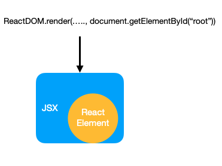

### 1. Introduction

React is popular javascript frameworks for building frontend application. It focuses on providing a framework for modeling UI component. In this article, we will learn React by analyzing design patterns and principals that are used in the framework.

### 2. React general flow



To render react app, it needs to attach root node of React into a Html DOM. A node in React can have one or multiple children. To have more descriptive format, React is often written as JSX element.

```js
// normal react element
const e = React.createElement;

return e(
  'button',
  { onClick: () => console.log('clicked') },
  'Like'
);

// JSX element
return (
  <button onClick={() => console.log('clicked')}>
    Like
  </button>
);
```

JSX elements are compiled with tools like Babel before ReactDOM can render them into the page. 

### 3. Design patterns in Reacts

React embraces both funtional and object oriented styles in class component or functional component. Since it inherits object oriented programming (OOP), we can see all the common OOP characteristics in React class component.

- React inheritance - constructor pattern

This is the most prominent software princinpal that is used in React. To create any class component, it needs to derive from a base class. Let's examine a simple version of React class

```js
class ReactComponent {
  //1st group: mounting
  constructor(props) {
    this.props = props;
  }
  static getDerivedStateFromProps(){}
  render(){}
  componentDidMount(){}

  //2nd group: updating

  // static getDerivedStateFromProps(){}
  shouldComponentUpdate(){}
  // render()
  getSnapshotBeforeUpdate(){}
  componentDidUpdate(){}

  //3rd group: unmounting
  componentWillUnmount(){}

  setState(newState){
  }
}
```
As we can see, `ReactComponent` defines a common template, and every class component can `inherit` the template and thus have the same set of methods. More importantly, React can use each set of methods to manage component life cycles e.g. mounting, updating, unmounting. For example, in updating phase after component's state is changed, React can sequentially call methods 
```js
  shouldComponentUpdate(){}
  render()
  getSnapshotBeforeUpdate(){}
  componentDidUpdate(){}
```
- React composition, encapsulation

Another key design principal in React is composition and encapsulation. Those two principals are popular for OOP, and React uses them in the form of component's state and react children. A class component in react can have its own state, encapsulated from others component state. For composition of react children, let's see an example

```js
function App() {
  return (
    <div>
      <Header />
      <SearchPanel />
      <Footer />
    </div>
  );
}

ReactDOM.render(
  <App />,
  document.getElementById('root')
);
```
`App` component is composed from 3 components `Header`, `SearchPanel` and `Footer`. Having composition ability helps React breaks UI into small and manageble parts which makes it easier to develop and maintain each component.

- React hook - strategy pattern

To create a component in React, besides class component, we can also use functional component. Just like normal function in javascript, we can write a simple functional component as 

```js
function Welcome(props) {
  return <h1>Hello, {props.name}</h1>;
}
```

Similar to react class, React will take the element which is created from function `Welcome` and attach it into DOM. Often times, functional component needs to manage state and life cycle, and React Hooks is the way that helps them do that. For example:

```js
function Welcome(props) {
  const [loggedIn, setLoggedIn] = React.useState(false);
  // ... code to setLoggedIn
  return loggedIn ? <h1>Hello, {props.name}</h1> : null;
}
```

The way React supports hooks is that every functional component has list of `state` and `effect`, and when we add `state` and `effect` in component, they will be included in the list so that React reconciler can use them when calculater rendered DOM element and execute the `effect`. In my personal view, this feature is similar to strategy pattern in OOP. Hooks define a generic state and effect interfaces, and functional components inject different implementation for `state` and `effect`. 

- HOC - Decorator pattern

Higher Order Component (HOC) is commonly used in React application. It reduces code duplication as we can put a common logic in a HOC and re-use it every component that needs the piece of logic.

```js
function logProps(WrappedComponent) {
  return class extends React.Component {
    componentDidUpdate(prevProps) {
      console.log('Current props: ', this.props);
      console.log('Previous props: ', prevProps);
    }
    render() {
      // Wraps the input component in a container, without mutating it.
      return <WrappedComponent {...this.props} />;
    }
  }
}

//later it can be used as
//... export default logProps(Header)
//... export default logProps(SearchPanel)
```

Decorator pattern has the same behavior with HOC, it is used to enhance objects and methods. There is no limit in number of decorator layers on a component, but we should only use it when there's common logic need to be shared.

### 4. Summary

To work in React effectively we need to understand the principal of the framework. The key thing in React is composition. One component can compose many other components which increases separation of concerns and allowing to reuse and share components easily. 
