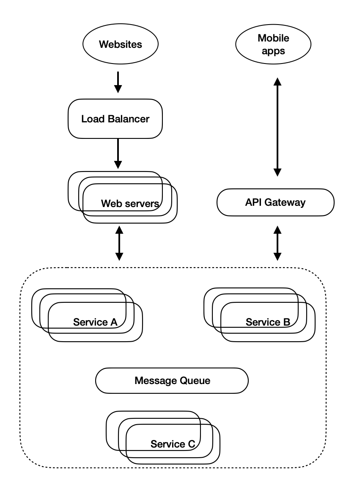

>There is nothing new except what has been forgotten.
>
>-- Marie Antoinette

At the start of software developer career, most programmers focus on learning technologies, algorithms, languages...etc, to be able to land a good job. At some points later, there will be need to design applications from scratch.  In this blog I want to highlight some important aspects in architecture, development and monitoring for developing large scale applications. 

### Architecture
The ultimate goal of an application is to make profits for company. As a result, cost and resources are always the first priority in designing process. Many companies prefer cloud infrastruture due to the ability to scale seamlessly. Most of applications nowadays are built on top of microservices. A typical architecture to represent these technologies as following:

 <!-- TODO: overall architecture -->
  
*
System architecture
*

In customer facing web application, generally web servers are put behind a load balancer which helps reduce the complexity of resolving IP address from DNS. Behind these websites could be a set of microservices, communicating directly to one another. The microservices can be abstracted through API gateway layer which generalizes the interfaces of the services for mobile app requests. The independence of the microservices will determine the scalability of the application. There are some main many ways for each service to communicate with each other, e.g hard code IP addresses, configuration files, load balancing, service discovery. While other methods are quite straight forward, load balancing and service discovery are the modern techniques employed in big applications. 

#### Load balancing (LB)
LB is a popular terms in cloud infrastructure. In fact, it is a critical component in the system. LB handles all traffic and make sure all servers receive comparatively equal amount of network requests. Large scale applications often have one LB sit in front of all main web servers. However, using LB proves to have many problems in backend systems. 

In microservices, LB introduces additional layer which creates single point of failures. When serviceA connect to serviceB through LB, it will have higher latency than the twos connect directly with each other. A common approach  to solve the issues is service discovery. 

 #### Service discovery
  <!-- TODO: apps with service discovery -->
Each service, before sending request to other services, needs to request for the list of available servers. After this `discovering phase`, the services can send requests to each other. The list of available servers is updated periodically and each server also update its status when necessary. Service discovery usually used in `service mesh` architecture which increases observability and resiliency for microservices.

When one service send a request to another, the result might or might not return immediately. To response to a request of another service, without blocking the request is the main aim of `message queueing`.

#### Message queueing

The performance and scalability of systems depends heavily on how well they handle asynchronous process. In web api application, developers make sure each function or method can execute its tasks asynchronously, avoid locking up server's resources.

 <!-- TODO: service with message queue -->
 
By the same principal, the communication across systems should also be asynchronous. When serviceA need to have a task done by serviceB, serviceA can send a message to a queue and serviceB can pickup when available. Message queueing helps increase scalability of each service.

### Development

A popular concept that goes closely with microservices is CICD (Continuous Integration, Continuous Deployment). As the number of microservice grows, the complexity of CICD also increases. A common sense is that for each service, it is only deployed when all tests passed. The question is how to ensure the level of test stability while at the same time cover all business logic within the microservice. To increase the isolation of tests and maintain integration ability, `contracts testing` is recently preferred as a good approach in this regard. The main purpose of contracts testing is to ensure services returns correct outputs when given certain inputs. 

Deployment is also an important aspect in development of microservices. The best approach is canary deployment in which a small set of servers will be deployed with new version of the service. After a certain period or some validations are passed from those servers, the service will continue to be deployed for the rest of servers. Canary deployment helps detect issue early with minimal effect on production systems, thus ensure new version of service is rolled out smoothly.

### Monitoring

Design as best as you can, systems will go down at some point in time due to various reasons: hard disk full, server batch updates, application throws exceptions...etc. Good monitoring is the mean to maintain high quality products and systems. What to monitor and how to act when problem arises are also important challenges for microservices. 

The 4-dimension that any microservice should be monitoring are as following: traffic, latency, errors and saturation.
<!-- TODO: 4 dimention monitoring -->

For complex service, it should have oncall who is responsible on the day and sufficient guide for handling production alerts. One important step for the oncall is log and record a post mortem to analyse incidents.

### Final thoughts

It is useful to have a complete picture in developing large scale systems. I hope this article give you more perspectives and directions to research deeper into the area.