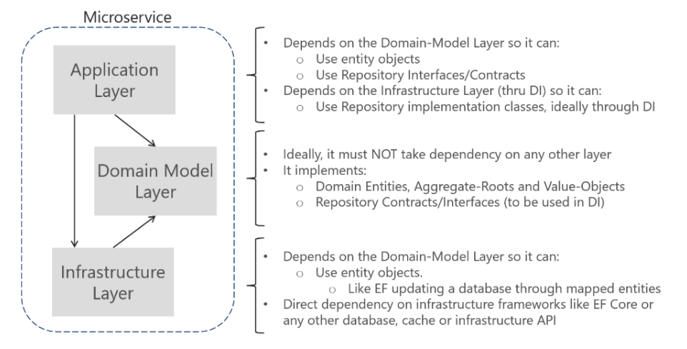

***

### 1. Introduction

Micro service is increasing popular in software development nowadays. The idea is to break big, monolithic systems into smaller services so that they can be managed or scaled easily. To work with these services, it is important to understand common server architectures and designs. In this article, I will compare and analyse Domain Driven Design (DDD) and Clean architecture, then discuss common patterns for micro services.

### 2. Domain driven design (DDD) for micro-services

Sotwares exist to solve human problems. How easy to develop and maintain sotwares is key to software design and architecture. DDD is an approach that bridge the gap between technical with bussiness knowledge, thus it can foster the communication between software developers and domain experts. DDD models classes and objects (bounded context) based on business domains. An example architecture for DDD with micro services can be described in following picture:

### 3. Clean architecture (Onion architecture)

### 4. Micro services pattern

### 5. Summary

### References
https://github.com/lucasbento/graphql-pokemon/blob/master/src/type/PokemonType.js