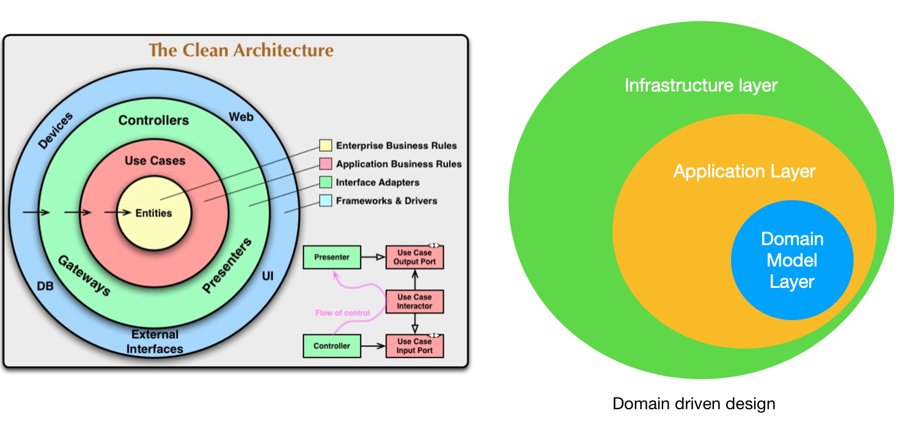
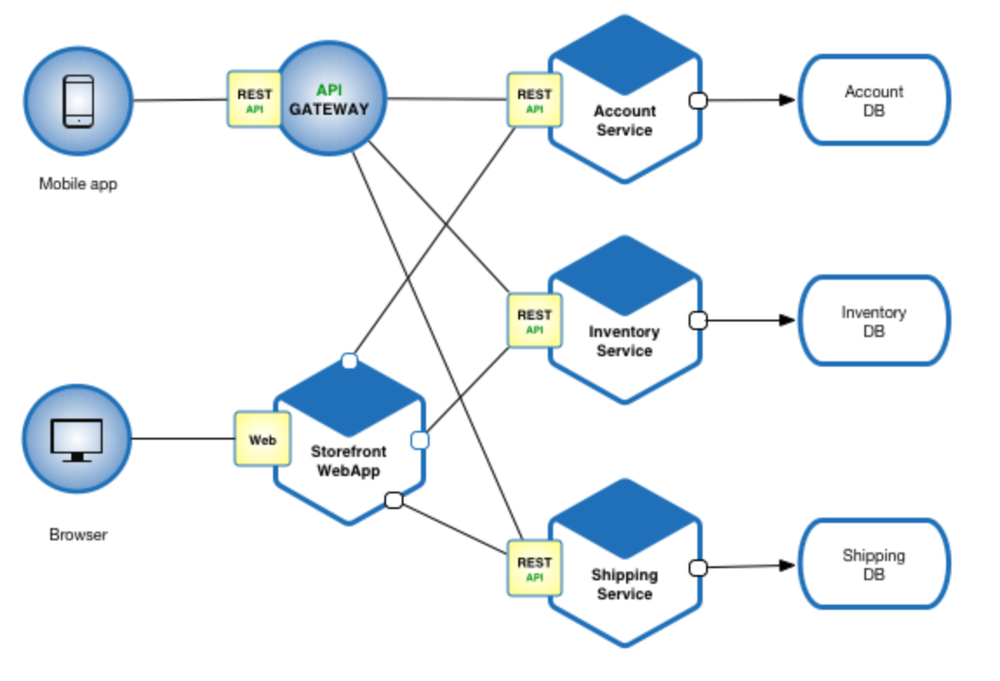
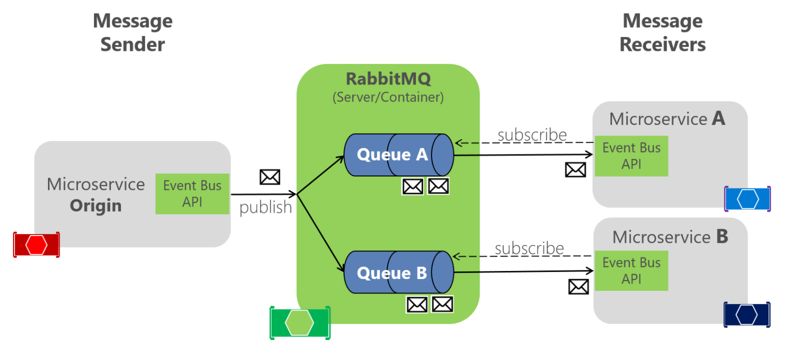

***

### 1. Introduction

Micro service is increasing popular in software development nowadays. The idea is to break big, monolithic systems into smaller services so that they can be managed or scaled easily. To work with these services, it is important to understand common server architectures and designs. In this article, I will compare and analyse Domain Driven Design (DDD) and Clean architecture, then discuss common patterns for micro services.

### 2. Domain driven design (DDD) for micro-services

Sotwares exist to solve human problems. How easy to develop and maintain applications is key to software design and architecture. DDD is an approach that bridge the gap between technical and bussiness knowledge, thus it can foster the communication between software developers and domain experts. DDD models classes and objects (bounded context) based on business domains. An example architecture for DDD with micro services can be described in following picture:

Figure 1: Domain driven design for micro service
  

As we can see, at the core of the architecture is the Domain Model Layer. It contains domain entities, aggregate roots or business services. These services generally should have interfaces and implementations to reflect business logic. Domain Model Layer also contains repository or external contracts and intefaces to ensure the dependency inversion principal. It is because application layer and infrastructure both depends on domain model layer, which makes domain model layer completely separated from the other two.

Application Layer is what clients interact with, it should has Viewmodels for api endpoints. In general, we should not expose domain objects directly to clientside. This layer depends on core (domain model layer) to use the business services, entity objects, repositories (ideally through dependency injection). From interfaces of repositories in domain model layers, application layer can use DI (dependency injection) to get the implementations from infrastructure layer.

Infrastructure Layer depends on domain model layer to use entities and repository contracts and interfaces. This layer contains actual implementation of repositories. By this separation, it will be easy to switch external dependencies (e.g. change MySQL server to MongoDB, or add caching layer for external dependencies). As described above, application layer can reference to this layer for injecting repository implementations. In practice, Infrastructure layer often has a caching layer to improve speed when acessing external services.

This DDD architecture is language agnostic, it can be applied in many languages such as C#, Java, Scala, or even Nodejs. Nodejs run on Javascript engine, therefore it doesn't have typecheck (i.e interfaces), but the structure can still be used for separation of concerns. In my opinion this structure makes more sense than the clean architecture (or Onion architecture).

### 3. Clean architecture (Onion architecture)

In Uncle Bob blog for clean architecture, he describe API systems should have dependencies flow inwards. Inner layers should not know any thing about outer ones. That structure still maintain the separation of concerns for each layer and follow the dependency inversion principals. To compare DDD for micro service and the Onion architecture, Let's see them together in the following picture:

Figure 2: Clean architecture and Domain driven design
  

As you can see in Figure 2, after redraw DDD as onion styles, we see an incorrect point of Clean architecture is that when using dependencies injection, the application layer in fact need to reference to infrastructure layer for repository implementations. Clean architecture still has a good point to ensure separation of concerns and dependency inversion. But in practise, I think it's not completely correct in terms of dependencies between outer layers and inside ones.

### 4. Micro services pattern

In large applications with many micro services, they usually employ and intermediate api gateway layer to incooporate relevant micro services together as following picture:

Figure 3: API gateway pattern
  

Api gatway layer provide additional abstraction layer which help clients interact with api services easier. Different type of clients (e.g. mobile web, mobile app, desktop) can have different api gateway endpoints to return only needed data for clientside (backend for frontend approach).

### 5. Message queuing architecture

In Api services that require long operation (e.g payment, reservation api). To ensure the scalability in these systems, meassage queuing is often employed. The main concept is similar to asynchronous actions, when receive a request, api service just push them in a First-in-first-out queue. In sub-services will then subscribe to the queue and start to process each request. An example in following picture

Figure 4: Message queue architecture
  

A main api service (e.g. api gateway layer) can receive request then publish messages into multiple queues, then the smaller micro services can subscribe to corresponding queue and process requests from the queue. When systems have heavy traffic from frontend, they can deploy more instances of `microservice A` and `microservice B` accordingly.

### 6. Summary

Domain driven design for micro service is widely used to structure api applications. Besides the benefits of smoother communication between technical and domain experts, DDD and clean architecture ensure the separation of concerns and dependency inversion principal for api systems. Those characteristics help maintain and develop api system easier. In large applications, a gateway layer or message queue can be used to provide more abstraction layer and increase the scalability for applications. 

### References

[Clean architecture](https://blog.cleancoder.com/uncle-bob/2012/08/13/the-clean-architecture.html)

[Domain driven design for microservice](https://docs.microsoft.com/en-us/dotnet/architecture/microservices/microservice-ddd-cqrs-patterns/ddd-oriented-microservice)

[Microservice pattern](https://microservices.io/patterns/microservices.html)

[Message queuing architecture](https://docs.microsoft.com/en-us/dotnet/architecture/microservices/multi-container-microservice-net-applications/rabbitmq-event-bus-development-test-environment)
