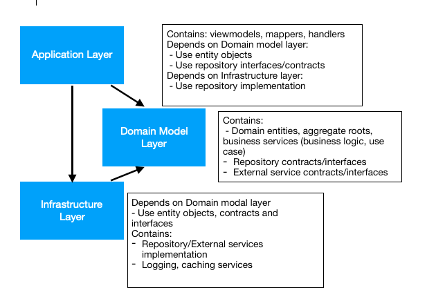
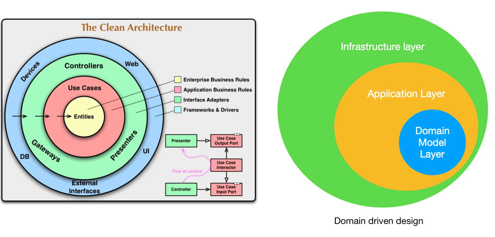
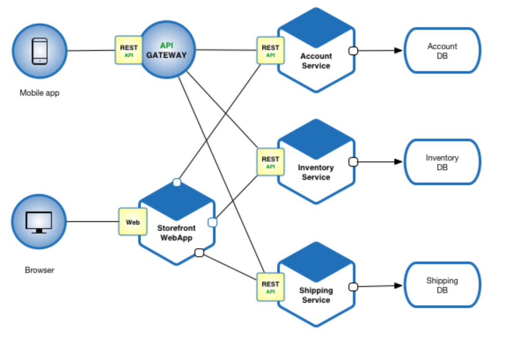
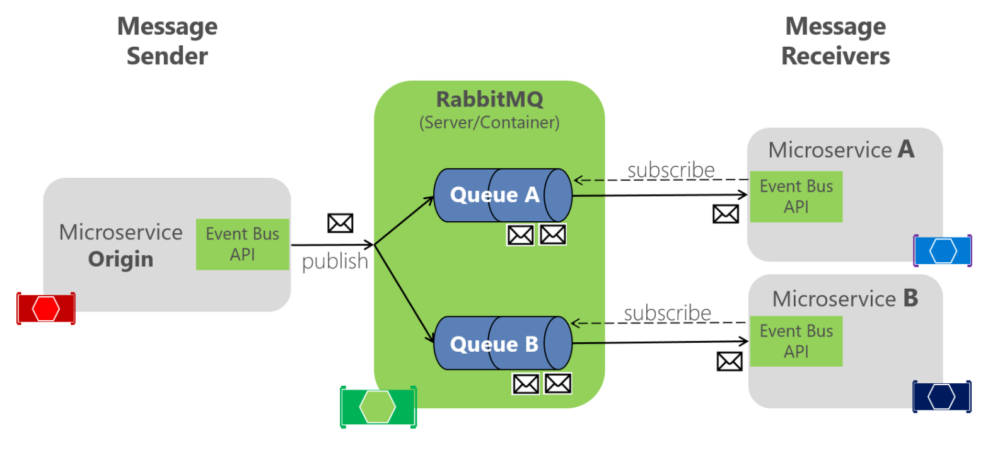

***

### 1. Introduction

Microservice is increasingly popular in software development nowadays. The idea is to break large, monolithic systems into smaller services so that they can be managed or scaled easily. To work with these services, it is important to understand common server architectures and designs. In this article, I will compare and analyse common server architectures, then discuss popular patterns for microservice.

### 2. Domain driven design (DDD) for microservice

Sotwares exist to solve human problems. How easy it is to develop and maintain applications is key to software design and architecture. DDD is the approach that bridge the gap between technical and bussiness knowledge. It can foster the communication between software developers and domain experts. DDD models classes and objects (bounded context) based on business domains. The architecture for DDD with micro services can be described in following picture:

Figure 1: Domain driven design for microservice
  

As we can see, at the core of the architecture is the **Domain Model Layer**. It contains domain entities, aggregate roots or business services. These services generally should have interfaces and implementations to reflect business logic. Domain Model Layer also contains repository contracts and intefaces to ensure the dependency inversion principal. It is because application layer and infrastructure both depend on domain model layer, which makes domain model layer completely separated from the other two.

**Application Layer** is what clients interact with, it should has viewmodels for api endpoints. In general, we should not expose domain objects directly to clientside. Therefore, mappers are used to convert domain entities to viewmodels and return only needed data for clientside. This layer depends on core (domain model layer) to use the business services, entity objects, repositories (ideally through dependency injection). From interfaces of repositories in domain model layer, application layer can use DI (dependency injection) to get the implementations from infrastructure layer.

**Infrastructure Layer** depends on domain model layer to use entities and repository contracts and interfaces. This layer contains actual implementation of repositories. By this separation, it will be easy to switch external dependencies (e.g. change MySQL server to MongoDB by having multiple implementations of same repository contract). As described above, application layer can refer to this layer for injecting repository implementations. In practice, Infrastructure layer often has a caching layer to improve speed when accessing external services.

This DDD architecture is language agnostic, it can be applied in many programming languages such as C#, Java, Scala, or even Nodejs. Nodejs run on Javascript engine and doesn't have typecheck (i.e interfaces), but the structure can still be used for separation of concerns. In my opinion this structure makes more sense than the clean architecture (or Onion architecture).

### 3. Clean architecture (Onion architecture)

In Uncle Bob blog for clean architecture, he describes API systems should have dependencies flow inwards. Inner layers should not know any thing about outer ones. That structure maintains the separation of concerns for each layer and follow the dependency inversion principal. To compare DDD for microservice and the Onion architecture, Let's see them together in the following picture:

Figure 2: Clean architecture and Domain driven design
  

As you can see in Figure 2, the core of clean architecture is entities, which is equivalent to domain modal layer in DDD architecture. The difference in clean architecture is it splits application business logic into another layer in `uses cases`, while in DDD approach business rules are still in domain model layer. Application layer in DDD can be mapped to `Controllers`, `Gateways` and `Presenter` in clean architecture. The outer most layer in clean architecture consists of external frameworks, actual implementation of repositories, loggings...etc.

After redrawing DDD in onion style, we see an *incomplete point of Clean architecture* is that, when using dependencies injection, the application layer in fact needs to have reference to infrastructure layer for repository implementations. Clean architecture still has good points to ensure separation of concerns and dependency inversion. But in practise, I think it's not fully reflect the dependencies between outer layers and inside ones.

### 4. Gateway pattern

In large applications with many microservices, they usually employ and intermediate api gateway layer to incooporate relevant microservices . Example architecture as following:

Figure 3: API gateway
  

In the example, each client (e.g mobile or desktop) has a separate api gateway layer. Api gateway handle requests from clientside then compose `account`, `inventory` and `shiping` service to process requests.

Gateway provides additional abstraction layer which helps clients interact with api services in higher level of actions or commands. For example, gateway can have generic endpoint like `booking`. When clients send requests to the endpoint, it will then based on business logic to dispatch smaller requests to `account`, `inventory` and `shiping` services. The results of smaller requests from sub-services are joined together in gateway layer to yield final result to frontend. Different types of frontend clients can have different gateway endpoints in order to return only needed data for clientside (backend for frontend approach).

### 5. Message queue architecture

In api services that require long operations (e.g payment, reservation api), meassage queue is a common approach to ensure the scalability in these systems. The main concept of this architecture is similar to asynchronous actions. When receive a request, api service just pushes them in a FIFO (first in first out) queue. Sub-services that subscribe to the queue will then start to process each request. An example architecture is as following:

Figure 4: Message queue architecture
  

RabitMQ is one of the technologies that implements message queue architecture. In the example, a main api service (e.g. gateway layer) receives requests then publish messages into multiple queues. After that smaller micro services get the messages from the corresponding queue and process them. When systems have heavy traffic from frontend, they can deploy more instances of `microservice A` and `microservice B` accordingly. This architecture unblocks resources both on client and server side. While waiting for messages to be processed by sub-systems, servers can handle other requests.

### 6. Summary

Domain driven design for microservice is widely used to structure api applications. Besides the benefits of smoother communication between technical and domain experts, DDD and clean architecture ensure separation of concerns and dependency inversion principals for api systems. Those characteristics help maintain and develop api systems easier. In large applications, a gateway layer or message queue can be used to provide additional abstraction layer and increase the scalability for applications. 

### References

[Clean architecture](https://blog.cleancoder.com/uncle-bob/2012/08/13/the-clean-architecture.html)

[Domain driven design for microservice](https://docs.microsoft.com/en-us/dotnet/architecture/microservices/microservice-ddd-cqrs-patterns/ddd-oriented-microservice)

[Microservice pattern](https://microservices.io/patterns/microservices.html)

[Message queuing architecture](https://docs.microsoft.com/en-us/dotnet/architecture/microservices/multi-container-microservice-net-applications/rabbitmq-event-bus-development-test-environment)
