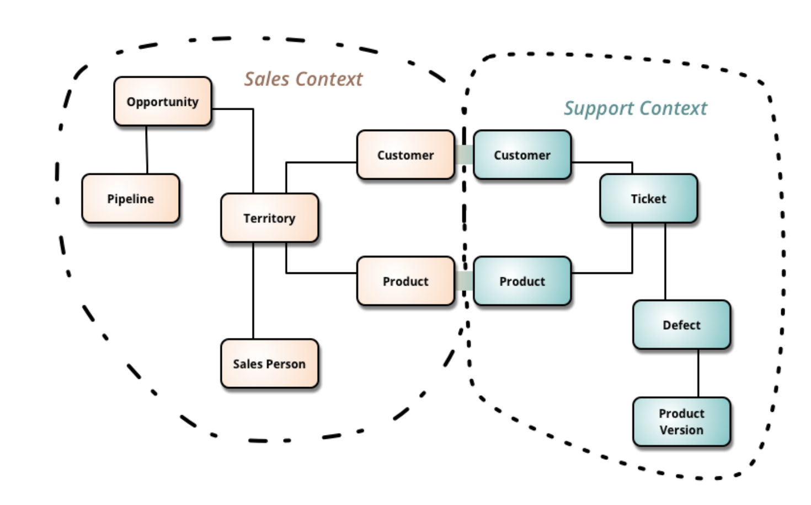
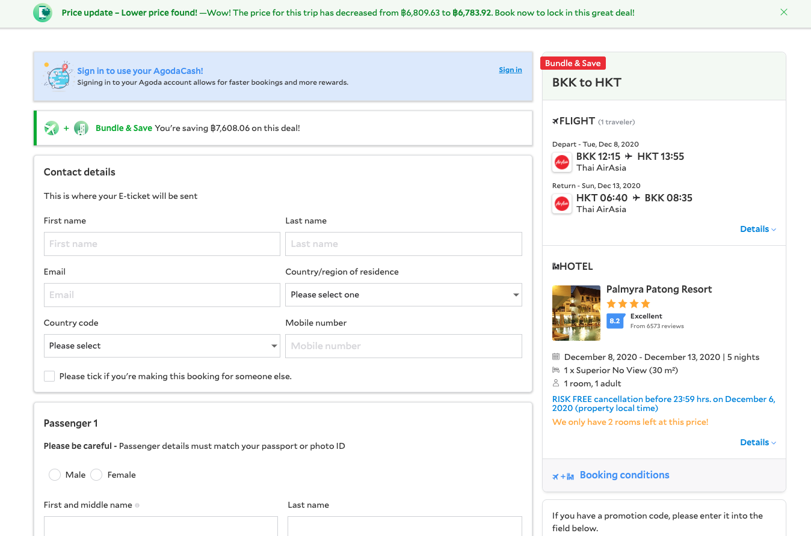

### Introduction

Clientside development is getting more and more complex, especially with applications that need to interact with multiple domains. The problem in big applications with multiple domains is that it is very easy to add complexity into the growing application. If not careful, it will be unmanageable at some point. In my opinion, we can prevent the problem with good architecture and right structure of the codebase. It is not new to apply Domain driven design (DDD) to clientside, just that there are not many discussions on the topic in the community. We can only find the best solution if more people talk and discuss it. In this post, I will offer my view on how we can apply DDD to structure clientside codebase.

### Domain driven design (DDD)
Definition of DDD from Wikipedia
>Domain-driven design is the concept that the structure and language of software code should match the business domain.

We can see more details in following example [picture](https://martinfowler.com/bliki/BoundedContext.html): 

One prominent application of DDD is in clean architecture which I described in the previous [post](https://thangledev.com/common-server-architectures-for-micro-serivce). Apply DDD correctly, we can gain a lot of benefits in developing applications. 

### Why do we need DDD for clientside

The fact that Javascript supports both function and object oriented programming is actually making it harder for developers to decide whether they should use a small helper function or a method of a class. In my experience I see most of people prefer small, quick functions in javascript to complete their tasks. That is the main reason why domain knowledge get scatter to many places. Then it's harder for the next maintainer of the project to understand all of that knowledge. DDD is perfect solution for that. Using DDD can help us to put all relevant knowledge into a one place, thus it will be easier to maintain and keep application complexity under control.  

### DDD for clientside

Clienside development usually contains an ecosystem of libraries. e.g. React, Redux, styled-component, Apolo client, etc. The following picture describes the application structure with DDD principle. 

- Domain Component vs Pure UI Component

The name already suggested the idea of `Pure UI component`, it is used for small, dump UI component that can be re-used in many places. Within `Pure UI` area, components can be `Element` or `Layout`. `Element` is a single independent component such as: Button, dropdown, icons... while `Layout` usually composes many `Elements` and put them in the same `Layout`. `Logic` in `Pure UI component` is any logic you may have for that UI part e.g. React hooks, setTimeout, debounce logic...

The similar idea is also applied for `Domain Component`, it can have `Element`, `Layout` and `Logic`. `Domain component` consists of many `Pure UI` components. `Layout` in `Domain Component` can be considered as container components that handle all the logic and keep `Element` components pure.

- Domain and Feature

Each domain is a bounded context, that contains everything like `Model`, `Logic` and `Domain Component`. In clientside context, `Logic` should have all `selectors`, `mappers`, `reducers` and `actions` (in case of Redux). 

Feature or Page is an aggregate of domains. For example in check out page of Agoda website, the cart can have many items like hotel rooms, flight itinerary. 

- Application base

For application to work, there are other necessary parts like `Infrastructure`, which contains services such as ajax, logging. Everything that needs to boostrap the application. Application may also have `Utilites` for helper functions e.g `date` and `string` helpers.

### What do you think ?
This is an opinionated way to apply DDD for clientside, I would love to hear if you find any problem or have better idea.