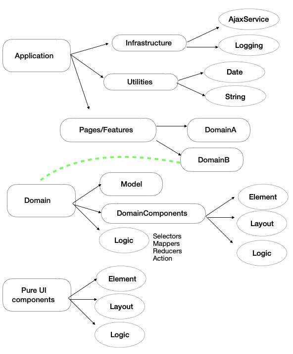

### 1. Introduction

Clientside development is getting more and more complex as the number of frameworks and libraries increase. Especially with applications that need to interact with multiple domains. The clientside codebase of these applications are huge. Recently I grew interest on the topic and want to dive deeper into it. 

The problem in big applications with multiple domains is that it is very easy to add complexity into the growing application. If not careful, it will be unmanagable at some point. In my opinion, we can prevent the problem with good architecture and right structure of the codebase. It is not a new idea to apply Domain driven design (DDD) to clientside, just that there are not many dicussion on the topic in the community. We can only find the best solution if more people talk and discuss it. In this post, I will offer my view on how we can apply DDD to structure clientside codebase.

### 2. Domain driven design (DDD)
Definition of DDD on Wikipedia
>Domain-driven design is the concept that the structure and language of software code should match the business domain. (Wikipedia)

We can see more details in following example [picture](https://martinfowler.com/bliki/BoundedContext.html): 

One prominent application of DDD is in clean architecture which I described in the previous [post](https://thangledev.com/common-server-architectures-for-micro-serivce). Apply DDD correctly, we can gain a lot of benefits in developing applications. 

### 3. Why do we need DDD for clientside

The fact that Javascript supports both function and object oriented programming is actually making it harder for developers to decide whether they should use a small helper function or a method of a class. In my experience I see most of people prefer small, quick function in javascript to complete their tasks. It is the main reason why domain knowlege get scatter to many places. Then it's harder for the next maintainer of the project to understand all of that knowledge. DDD is pefect solution for that. Using DDD can help us to put all relevant knowledge into a one place. Thus it will be easier to maintain and keep application complexity under control.  
- example 

### 4. DDD for clientside
This is an opinionated way to apply DDD for clientside, I would love to hear if you find any problem or have better idea.

-description

### 5. Summary