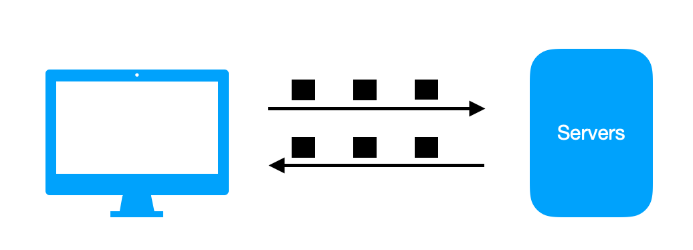
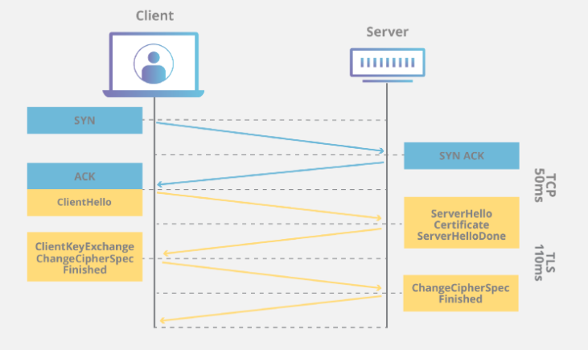

***

With the increasingly popularity of Javascript and frontend frameworks like Reactjs, Angular, or Vue...etc. More and more application logic is shifted into user browsers. As a results, personal data is exposed to greater risks of being exploited by attackers nowadays. For web developers, it's important to understand all the security fundamentals to protect web application. In this article, I will analyse common security risks and the approaches to prevent them. 

### 1.Overview


*<center>Figure 1: Network packages</center>*

As we see in *Figure 1* networks packages are transfered from servers to users in order to display content on browsers. Security involves all parts of that process, from clients to servers. Let's look into each part to see what are the potential flaws and how to mitigate them. 

### 2. Secure network

On the internet, before one package could reach its destination, it may go through several hubs and switches. The package could be intercepted, and viewed by attackers (man in middle). One popular approach to fix it is encrypt packages that are sent on network.

#### HTTPS 
HTTPS (hypertext transfer protocol secure) is a secure version of HTTP. It uses TLS (transport layer security) to encrypt messages inside network package before send it to network. Before encryption progcess, servers have to obtain SSL (secure socket layer) certificate first. The certificate consists of public key, private key and all related information of websites. Before sending HTTPS requests, client needs to complete a TLS handshake to obtain session keys as following diagram:


*<center>Figure 2: TLS handshake</center>*

TLS handshake occur after a TCP (transmission control protocol) connection has been open. The end result of the handshare are session keys.

#### HSTS

HTTPS helps secure connections from client and servers, and to enforce HTTPS for every users that want to access your site, you can use HSTS (Strict Transport Security). Essentially, HSTS
is a server header that for browsers to use HTTPS if they are trying to connect via HTTP. For example, assume we want to go to amazon with normal HTTP by input url `www.amazon.com`, you can see request, and response as follow:

```json
// request
Request URL: https://www.amazon.com/
Request Method: GET
Status Code: 200 
Remote Address: 13.225.25.182:443
Referrer Policy: no-referrer-when-downgrade

// response
...
strict-transport-security: max-age=47474747; includeSubDomains; preload
```
We can see that even though the url requested is normal HTTP, browser can recognize the domain has `strict-transport-security` header from HSTS, thus it convert request to HTTPS.

HTTPS and HSTS secure connections between clients and servers. Let's look into clientside to see what are potential security risks there.

### 3. Why browser has security flaw

Browser is a very flexible application, it can display many types of contents, e.g, html, xml, images, pdf... or execute Javascript code. And with JS code, it can create dynamic content and then attach it back to the browser, like a recursive loop. This great flexibility also impose a great risk of attackers injecting mallicious scripts to steal users information. So all the security risks on browsers are due to ability to run JS scripts, and attackers often try to inject mallicious scripts to steal user information. In addition, when web application has form for user to post data, attackers could use that to post script to servers and try to take control on server side as well (SQL injection). 

The defense mechanism for servers is to encode all the posted data, to ensure that no special character that can potentially create a running script on server side. On clientside, the first defense which was quite popular in the past is to disable JS script all together for browsers. However, the advance of clientside frameworks, and Ajax programming make website increasingly depend on JS code. Thus disabling JS code is not a viable option. Before exploring more common protection mechanism on clientside, let's examine at some common attacks:

**XSS (Cross site scripting) attack** This is the most common type of attack on browsers. In XSS, attackers try to steal users identity data like cookies, session token..., by injecting some scripts on browsers. Depends on each website, they may have different ways to inject code.

- Url injection: Assume that we have a website that user can access with url like

```html
// user go to http://www.mysite.com?productName=computer

//then later in html
<script>
    const url = new URL(window.location.href);
    let node = document.createElement('h1');
    node.innerHTML = `showing ${url.searchParams.get('productName')} product`
    document.body.appendChild(node);
</script>
```

- Script injection:
- CSRF 
***


### 3. Secure browser
    - URL encode
    - Cookie: secure, HTTP only
    - CORS
    - CSRF prevention
    - No referer policy
    - X-frame-option
    - CSP
    - CSP-once
### 4. Front-end libraries
    - React auto encode

### 5. Summary

### 6. Reference
[Figure 2: TLS handshake](https://www.cloudflare.com/learning/ssl/what-happens-in-a-tls-handshake/)
[HSTS](https://developer.mozilla.org/en-US/docs/Web/HTTP/Headers/Strict-Transport-Security)
