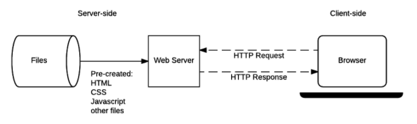
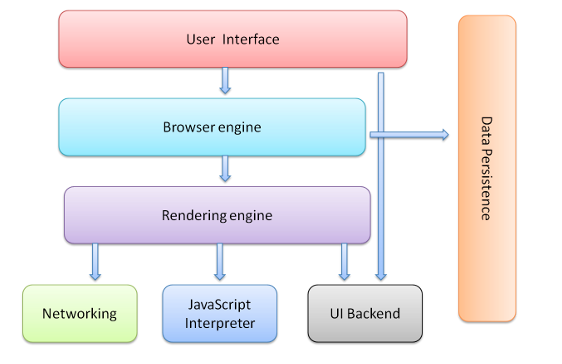
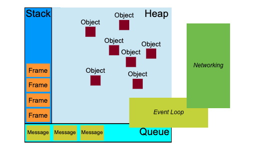
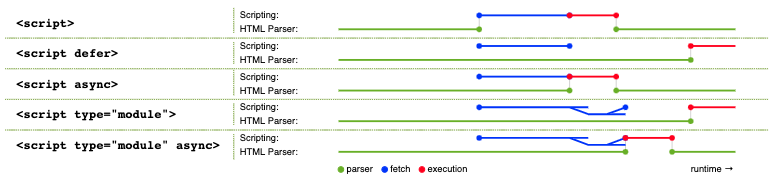
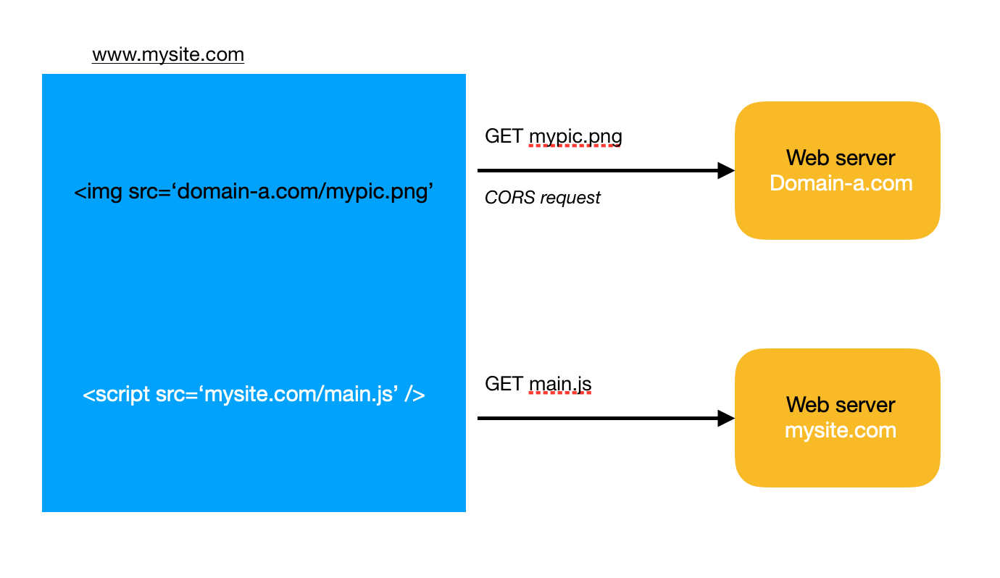

***

Performance is important aspect of web development, especially for ecommerce sites. To have a good performant site, we need to optimize many parts of the applications, from server to client sides. In this article, I will mainly analyse the factors that impact performance from client side, i.e. how does browsers work, and what we can do to improve performance of the site.

### 1. General Flow

 
*<center>Figure 1: Network overview</center>*

As we see in the image, when browsers need to display a website, at first it has to download resources (usually html files, but can also be pdf, images,..etc) via HTTP requests and then display the content on clientside. Example of simple HTTP request and response

```json
//request
Request URL: https://thangledev.com/
Request Method: GET
Status Code: 200
Referrer Policy: no-referrer-when-downgrade

//response
age: 2
cache-control: public, max-age=0, must-revalidate
content-encoding: br
content-type: text/html; charset=UTF-8
date: Sat, 30 May 2020 05:51:58 GMT
etag: "916afbcb0b6e36fc7356e932e6696d58-ssl-df"
...
```
Browsers can identify the type of HTTP response by `content-type` header. Let's examine what happens inside browsers when it get a HTML page response from server.

### 2. Browser components

In general, when browsers get content from network responses, they render and display it on computer screen. To understand the rendering process in details, we need to know what browsers are made of as in the following image:


*<center>Figure 2: Browser components</center>* 

**User Interface:** its main purpose is to display the content of a site, and also contains all the features that help user interact with browsers, e.g. navigation bar, input URL, manage history...etc.

**Browser engine, UI backend and rendering engine:** responsible for parsing html, stylesheet and rendering them to the user interface layer.

**Javascript interpreter:** parse and execute Javascript (JS) code.

**Networking:** sending HTTP requests and get responses from network.

**Data Persistence:** is where browsers store cookies, localStorage, sessionStorage...etc

In these components, browser engines and Javascript interpreter share the same thread and follows synchronous execution model, which means when browsers parsing HTML it cannot execute scripts and vice versa. However, the networking component usually has 2-6 threads (depends on browsers), that's why it can send 2-6 HTTP requests in parallel. In short, **browsers can only run synchronous actions except when sending HTTP requests**. We will explore the Javascript intepreter in details to understand how it can run asynchronous actions. 

### 3.Javascript interpreter


*<center>Figure 3: Javascript interpreter</center>*

Javascript interpreter, or can be called Javascript runtime, has three main components: Stack, Heap and Queue. The event loop runs in the main thread of browser. It constantly checks messages in Queue, and put them in Stack whenever the Stack is empty. Heap is like a memory of Javascript runtime, in which it stores all the runtime context such as variables, function, global `this` object...etc. Stack is where Javascript code get parsed and executed, if a function in the script execute, and then run another function, another Frame will be inserted to the Stack, so that JS runtime can keep track of the order of execution.

 In browser environment, Javascript runtime is connected to the networking component of browser. After getting HTTP reponses, the networking component insert callbacks to handle the reponses into the Queue. Because networking component runs on a different thread, it does not block JS runtime to execute scripts while sending network requests. The event loop and Queue are main reasons Javascript can execute asynchronous actions.

### 4. Rendering flow


*<center>Figure 4: Rendering flow</center>* 

As we see in the image above, before painting html content to users screen, browsers contruct a `DOM` tree and a `render` tree in the process. They are data representation of HTML tags. Rendering is an incremental progcess, browsers try to display the content as soon as possible. HTML document is usually broken down to multiple chunks of 8Kb and passed to rendering engine. 

At first step, HTML and css stylesheet are parsed to construct a DOM tree. Note that during this step, if the parsers encounter external links to stylesheet, images or JS files, they will stop and wait for download, parse and run (for javascript files), then resume parsing HTML afterward. The reason browsers is blocked if need to download and parse resources is because rendering engine share the same thread with JS intepreter.

After pasrsing HTML and stylesheet in the first step, the results are a DOM tree and styles context tree. In the second step, another tree which is called `render tree` is constructed based on the DOM tree and the style context. To visualize the render tree easier as a programmer, we can see the following code for an element (`RenderObject`) in the `render tree`: 

```cpp
class RenderObject{
  virtual void layout();
  virtual void paint(PaintInfo);
  virtual void rect repaintRect();
  Node* node;  //the DOM node
  RenderStyle* style;  // the computed style
  RenderLayer* containgLayer; //the containing z-index layer
}
```

The relationship between `DOM` node and `RenderObject` is not one-to-one, one `DOM` node can be referenced by many `RenderObject`. After the render tree is constructed, the document state will be completed and browser will emit the `DomContentLoaded` event. At this point any script tag with `defer` attribute in the html will start to download and execute.

In third step, the engine will calculate exact coordinate for each node of the render tree. After that, in the final step, the render tree is painted by UI backend component. Note that this painting process is incremental, usually browser keeps a list of UI changes that need to be painted, then at one point, it will flush all the changes at once to improve performance. Each node in the tree has a `dirty` boolean flag. The purpose of the flag is to keep track of which nodes have updated its styles, hence browsers can recompute only relevant nodes as oppose to the whole tree.

### 5.Performance consideration

Performance of browsers are mainly depended on how fast they can download and parse resources (html, javascript, stylesheet, images...etc). First rule of thumb is keeping the size of resources as small as possible, and consider using server caching or CDN (Content delivery network) for static resources. In addition, servers often compress javascript (as gzip files) or images to reduce the size that needed to transfer over network.

During the parsing process, if browser encounters script tags, images or stylesheet, it will stop parsing and start download the external resources, then execute them (in case of Javascript). Because the rendering engine and Javascript runtime share the same thread, if Javascript code is running, browser cannot do anything else. Let's go to some common techniques to improve performance of websites as following:

- **Javascript**: put JS files at the end of html page to prevent blocking browser parsing the page, and also avoid long operation methods in script. Try to breaks long operations methods into smaller chunks of execution. That way it can avoid blocking UI for end users. In case application is required to run heavy computational tasks in JS, you can export them to web workers, which are run on different threads. 

When scripts access style information like `offsetHeight`, they can trigger browsers re-painting DOM and reflow  document, because browsers need to provide the accurate style information for scripts, so they need to flush all pending changes to DOM. Thus try to avoid accessing style information if not neccessary. 

In Single Page Application (SPA), JS scripts control most of the work in rendering document, but for improving perceived speed of first page load, you can consider using server side rendering for the critical parts of the page (above the fold). Because in the first page load, the page doesn't need to load all the resources, it only need to load enough resources to render the critical part of the page, such that users can start to interact with the page. For example if you land to agoda.com, you can see the search box appears very fast.

*<center>Figure 5: Agoda Home</center>*

At first page load, the page just load enough resources to render the search box, and while users starting to search, it will then load the rest of the resources.

- **Stylesheets**: put stylesheets in head of HTML document to allow browser download it in first priority. With stylesheet, putting them at the end of HTML actually can harm the perceived speed of websites as browsers need styles information to paint the DOM tree. After parsing everything, if styles change, it will cause a whole page re-painted again. 

This rule is applied to scripts that interact with styles information too. when we calculate new styles of an element, avoid accessing and updating DOM many times, instead applying the changes in batch so that it can help browsers reduce the number of times needed to repaint document. For example:

```js
var mydiv = document.getElementById('mydiv');
myelement.width = '100px'; // browser repaint
myelement.height = '100px'; // browser repaint
myelement.style.margin = '10px'; // browser repaint
```
The above code will cause browser repaint the div element 3 times, instead of that, we can apply the batch change as follow 

```js
var mydiv = document.getElementById('mydiv');
const newStyle = {...mydiv.style};
newStyle.width = '100px'; 
newStyle.height = '100px'; 
newStyle.margin = '10px'; 

mydiv.style = newStyle; // browser repaint
```
The code creates `newStyle` object, it's detached from the DOM document. We can update the `newStyle` object separately then only apply the change one time. Similiarly for manipulating DOM, if we need to create DOM elements on the fly like inserting `<table>`, create new `<div>` ...etc, it's better to compute all the changes in one new object, then finally attach it to browser documnet.

- **Async and defer**: use `async` and `defer` attributes to specify the priority of each Javascript files. When browser sees scripts with `async` attribute, it will send the script to another thread to download, then parse in main thread when download is finished. With `defer` attribute, scripts will be downloaded after DOM tree finished parsing. You can see the order in more details in the following picture: 


*<center>Figure 6: Scripts parsing order</center>*

As you can see, `async` and `defer` scripts are downloaded in a different thread. Difference between `async` and `defer` is after finish downloading `async` script is executed immediately, while for `defer` script, it is executed when browser is in idle state. 

Script tags also support loading modules by using `type = module`. All scripts with that attribute is loaded as `defer` scripts, if we want them to execute immediately the scripts need to have the `async` attribute like `<script type="module" async>` 

- **Lazy load images**: image loading is an easy performance gain if done correctly. As we know that when parsing HTML with images inside, browser will be blocked, waiting for images to download. Common technique to mitigate that problem is to employ some kind of lazy loading mechanism. Optimizing for loading images is so important that now browers is starting to support lazy loading natively by using `lazy` attribute as: 

```js

```

For older browsers without support for it, we can use Javascript libraries to lazy load images. The main idea of lazy loading images is when images are not in current viewport that users can see, they don't need to be downloaded and rendered. Let's see it in an simple example of how we can implement `LazyImage` in React component

```js
import React from "react";
import Observer from "react-intersection-observer";

// simple version of LazyImage
const LazyImage = ({ url }) => {

    const [isInView, setIsInView] = React.useState(false);
    return (<div style={{width: "100px", height: "100px" }}> 
        <Observer
            rootMargin="50px 0px"
            threshold={0.01}
            onChange={inView => setIsInView(inView)}
            >
            {isInView ?  : null}
        </Observer>
    </div>);

    // TODO: if the image is already loaded, the component doesn't need to return null
}

```
What we have in the simple version of `LazyImage` component is a placeholder for rendering images, when image is not in view, the component will render nothing. Inside the component, it uses `Observer` to trigger a callback when `inView` state is changed. If you don't work with React, you can use the native `Intersection Observer API` in browser and implement a `Lazy` loader for you site.

- **Link prefech, preload**: Browses has support for `prefech` and `preload` resources like JS and css files. These attributes help browsers prioritize resource loading correctly. `preload` is used when some resources are absolutely needed in the current page. When this attribute is used, broswer will download the resource immediately in different thread. `prefetch`, on the other hand, is used to indicate that some resources will probably be required in future navigation, thus browser can load them in idle time. Example usage of these attribute as following:

```html
<head>
  <meta charset="utf-8">
  <title>JS and CSS preload example</title>

  <link rel="preload" href="style.css" as="style">
  <link rel="preload" href="main.js" as="script">

  <link rel="stylesheet" href="style.css">
</head>

<body>
  <h1>my article</h1>
  <canvas></canvas>

  <script src="main.js" defer></script>
</body>
```
In the example, style and JS files are put under `preload` links to let browsers download them in high priority without blocking parsing the document. Then later, when the parser actually encounter stylesheet and script tag, it already has the content to continue the work, hence eliminate the waiting time for browsers to load resources.

- **JS bundle splitting and dynamic import:** In mordern SPA or progressive web apps, they depends heavily on JS code, which makes JS files for these apps are often very big. In general, you should split JS files in smaller chunks to reduce resources' size on first load, and allow browsers to cache different chunks effectively. However, manually apply attributes like `async`, `defer`, `preload`, `prefetch` can cause much headache for developers. Webpack is a great tool to split the JS bundle to multiple files. Depending on user's navigation, the browser then can load only necessary JS codes. 

- **Cache control**: This is a header inside HTTP request that can help browsers decide whether to cache the HTTP response or not. At the beginning of the article we see the example of using `Cache-Control` inside response header as

```json
cache-control: public, max-age=0, must-revalidate
content-encoding: br
content-type: text/html; charset=UTF-8
date: Sat, 30 May 2020 05:51:58 GMT
etag: "916afbcb0b6e36fc7356e932e6696d58-ssl-df"
```
`Cache-Control` is often used together with `etag` to validate stale resources.

- **Reduce cookie**: Nature of HTTP requests is stateless. Hence in order to maintain application state, website often store information using cookie and browsers can send the cookies back to servers via HTTP requests. Example of server setting cookies for browser: 

```json
HTTP/2.0 200 OK
Content-Type: text/html
Set-Cookie: userId=1dfe3
Set-Cookie: visitCount=10
```

Normally, JS can access and manipulate cookies as follow: 
```js
document.cookie = "userId=1dfe3"; 
document.cookie = "visitCount=10; 
console.log(document.cookie); // output: "userId=1dfe3; visitCount=10"
```

 Having a lot of cookies inside HTTP headers will consume more network bandwidth, and increase latency of HTTP request and response. It not only hurts performance, but also increase security risks as cookies are very vulnerable to XSS attack. Thus you should keep cookies usage in your site at bare minimum.

- **Use simple CORS request**: 

In large app, resources are often hosted in another domain that's different with website domain. To download files in these cases, browsers have to send CORS request (cross domains request). Example scenario for CORS requests as following:


*<center>Figure 7: CORS request</center>*

A web server is hosted at the domain `www.mysite.com`, `mypic.png` on the other hand, is hosted at `domain-a.com`. In this situation, browser needs to issue CORS request to `domain-a.com` to get `mypic.png`. For requesting to static resources under CORS scenario, make sure to exclude cookies by not using the header `withCrdentials` in `XMLHttpRequest` to reduce requests' size

In addition, consider using only `simple` requests, not `preflighted` requests for CORS. `preflighted` requests cost 2 round-trip requests to get response from server, because at first it needs to send `OPTIONS` request to learn what servers can support. Using `simple` requests can save some network traffic. 

### 6.Summary

In this article, we analyze performance mostly on clientside of web application. Performance of websites depends on many factors, but for the most part, adjusting the process of loading resources plays a key role in tuning web application. A good practise is keep monitoring performance of your site and identify which areas that cause biggest problems. It's not recommended to begin performance analysis with CORS requests for instance, if you haven't looked into Javascript or images loading optimization. 

#### Image references
- [Figure 1: Network overview](https://developer.mozilla.org/en-US/docs/Learn/Server-side/First_steps/Client-Server_overview)
- [Figure 2,4: Browser components, rendering flow](https://www.html5rocks.com/en/tutorials/internals/howbrowserswork/)
- [Figure 6: Scripts parsing order](https://v8.dev/features/modules) 
#### Further readings
- [HTTP in browsers](https://developer.mozilla.org/en-US/docs/Web/HTTP)
- [How browsers work](https://www.html5rocks.com/en/tutorials/internals/howbrowserswork/)
- [V8 modules](https://v8.dev/features/modules)
- [Preloading content](https://developer.mozilla.org/en-US/docs/Web/HTML/Preloading_content)
- [Javascript event loop](https://developer.mozilla.org/en-US/docs/Web/JavaScript/EventLoop)
- [Lazy loading guide](https://developers.google.com/web/fundamentals/performance/lazy-loading-guidance/images-and-video)
- [Intersection Observer API](https://developer.mozilla.org/en-US/docs/Web/API/Intersection_Observer_API)
- [preload prefetch priorities](https://medium.com/reloading/preload-prefetch-and-priorities-in-chrome-776165961bbf)
- [Cache-Control](https://developer.mozilla.org/en-US/docs/Web/HTTP/Headers/Cache-Control)
- [Webpack](https://webpack.js.org)
- [CORS](https://developer.mozilla.org/en-US/docs/Web/HTTP/CORS)