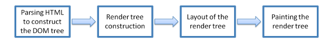

***

<!-- At times you can heard people say ***"browsers can only run synchronous actions"***, some can say ***"browsers can run asynchronous Javascript"***, which is correct ?? If both are true, how do they all fit together ? 

In this article, besides trying to answer those questions, I also believe that if you can understand the way browsers work and how it run Javascript code, you can improve performance of many parts on your site.

### 1. General Flow

 

As we see in the image [*(taken from MDN)*](https://developer.mozilla.org/en-US/docs/Learn/Server-side/First_steps/Client-Server_overview), when browsers need to display a website, it first need to download resources (usually html file, but can also be pdf, images,..etc) via HTTP requests and then display the content on clientside. Every part of the flow can affect performance of a website but in this article, we will be focus more on the clientside of the flow. Let's examine what happen inside browsers when it get a HTML page response from server.

### 2. Browser components

In short, when browsers get content from network requests, they render and display it on computer screen. To understand the rendering process in details, we need to know about what browsers are made of:

 
[*img source*](https://www.html5rocks.com/en/tutorials/internals/howbrowserswork/)

***User Interface:*** its main purpose is to display the content of a site, and also contains all the features that help user interact with browsers, e.g. input URL, save history...etc.

***Browser engine, UI backend and rendering engine:*** responsible for parsing Html and css and displaying on users' screen.

***Javascript interpreter:*** parse and execute Javascript code.

***Networking:*** sending HTTP requests and get response from network.

***Data Persistence:*** is where browsers store cookies, localStorage, sessionStorage...

Browser engines and Javascript interpreter share the same thread and follows synchronous model, which means when browsers parsing the HTML it cannot execute scripts and vice versa. However, the networking component usually has 2-6 threads (depends on browsers), that's why it can send 2-6 HTTP requests in parallel. In short, **browsers can only run synchronous actions except when sending HTTP requests**. We will explore the Javascript intepreter in details to understand how it can run asynchronous actions. 

### 3.Javascript interpreter

 

The original image is from [MDN](https://developer.mozilla.org/en-US/docs/Web/JavaScript/EventLoop) which describe the runtime of general Javascript engine. In web context, it has connection to the Networking component of browser. You can find out the details how event loop works in the [MDN](https://developer.mozilla.org/en-US/docs/Web/JavaScript/EventLoop) article. The main flow is after getting HTTP reponses, the networking component insert callbacks to handle the reponses into the Queue. The event loop and queue are the main reason Javascript can execute asynchronous code.

### 4. Rendering flow

 
[Image source](https://www.html5rocks.com/en/tutorials/internals/howbrowserswork/)

The rendering is a progressive progress, browsers try to display the content as soon as possible. Thus HTML document is usually broken down to multiple chunks of 8Kb and passed to rendering engine. 

At first step, HTML and css stylesheet are parsed to construct a DOM tree. Notice that during this step, if the parser encounter external link to stylesheet, images or javascript files, the parser will stop and wait for download, parse and run (for javascript files), then resume afterward.

We could do the same for external stylesheets but styles are required to paint the DOM tree, if the style get updated, it will cause repainting of the corresponding DOM nodes.

After pasrsing HTML and stylesheet in the first step, the results are a DOM tree and styles context tree. In the second step, a render tree is constructed based on the DOM tree and the style context. When finish this step, the document state will be complete and emit the `DomContentLoaded` event. At this point any script tag with `defer` attribute in the html will start to download and execute.

In third step, the engine will calculate exact coordinate for each node of the tree. Then in the final step, the render tree is painted by UI backend component. Note that this painting process is incremental, usually browser keeps a list of UI changes that need to be painted, then at one point, it will flush all the changes at once to improve performance. Each node in the tree has a `dirty` boolean flag. The purpose of the flag is to keep track of which nodes has updated styles, hence browsers can recompute only relevant nodes as oppose to the whole tree.

### 5.Improve performance

A you can see, the performance of browsers mainly depended on how fast they can download and parse resources (html, javascript, stylesheet, images...etc). First rule of thumb is keeping the size of resources as small as possible, and consider using server caching or CDN for static resources. In addition server often compress javascript (as gzip files) or images to reduce the size that needed to transfer the files over network.

During the parsing process, if browser encounters script tags, images or stylesheet, it will pause parsing the HTML document, and start to download the external resources, then execute them (in case of Javascript). Because the rendering engine and Javascript runtime share the same thread, if Javascript code is running, browser cannot do anything else.

- **Order of Javascript**: put Javascript files at the end of HTML to prevent blocking browser parsing the DOM 

For stylesheet, putting them at the end of HTML actually can harm the perceived speed of the website as browser need styles information to paint the DOM tree. After parsing everything, if styles change, it will cause a whole page re-paint again.

- **Order of stylesheet**: put stylesheets in head of HTML document to allow browser loading it in first priority.

- **Async and defer**: use `async` and `defer` attribute to specify the priority of each Javascript files. 

When browser sees script with `async` attribute, it will spin off another thread to download the script, then parse it in the main thread when download is finished. With `defer` attribute, scripts will be downloaded after the DOM tree finished parsing. You can see the flow in more details in the following picture 


[img source](https://v8.dev/features/modules)

- **Lazy load images**: image loading an easy performance optimization if done correctly. Now browers is starting to support it natively. For older browsers we can use some Javascripts library to do the lazy load as the example in [here](https://developers.google.com/web/fundamentals/performance/lazy-loading-guidance/images-and-video)

- **link prefech, preload, modulepreload**: [<Link>](https://developer.mozilla.org/en-US/docs/Web/HTML/Preloading_content) has support for `prefech` and `preload` resources for JS and css files. These attributes help browsers priority resource loading correctly. `preload` is used when some resources are absolutely needed in the current page. When this attribute is used, broswer will load the resource in different thread. `prefetch`, on the other hand, is used to indicate that some resource will probably be required in future navigation, so browser can load them in idle time. [details](https://medium.com/reloading/preload-prefetch-and-priorities-in-chrome-776165961bbf)

- **JS bundle splitting and dynamic import** In mordern apps, they depends heavily on JS code, that makes the JS files for these apps is often very big. [Webpack](https://webpack.js.org) is a great tool to split the JS bundle to multiple files. Depending on user's navigation, the browser then can load only necessary JS codes. Browser is also starting to support dynamic importing JS modules natively as in [v8engine](https://v8.dev/features/dynamic-import). However, manually using dynamic import will need a greater effort to make sure websites work properly.

### 6.HTTP request

- **Cache control**: This is a header inside HTTP request that can help browsers decide whether to cache the HTTP response or not, some example values are 

```
Cache-Control: max-age=<seconds>
Cache-Control: max-stale[=<seconds>]
Cache-Control: min-fresh=<seconds>
Cache-Control: no-cache
```

- **Reduce cookie**: In large app, resources are often hosted in another domain that's different with website domain. To download the files in these cases, browsers have to send [CORS](https://developer.mozilla.org/en-US/docs/Web/HTTP/CORS) request (cross domain). In these kind of requests, make sure to exclude cookies by not using the header `withCrdentials` in `XMLHttpRequest` to reduce requests' size

- **Use simple CORS request**: when your apps infact need to send CORS requests, you can consider only use `simple` requests as opposed to `preflighted` requests. `preflighted` requests will cost 2 round trips requests to get response from servers as at first, they need to send an `OPTIONS` requests to learn what servers can support. Thus using `simple` requests can save some network traffic. 


### Reference
https://www.html5rocks.com/en/tutorials/internals/howbrowserswork/
https://v8.dev/features/modules
https://developer.mozilla.org/en-US/docs/Web/HTML/Preloading_content -->