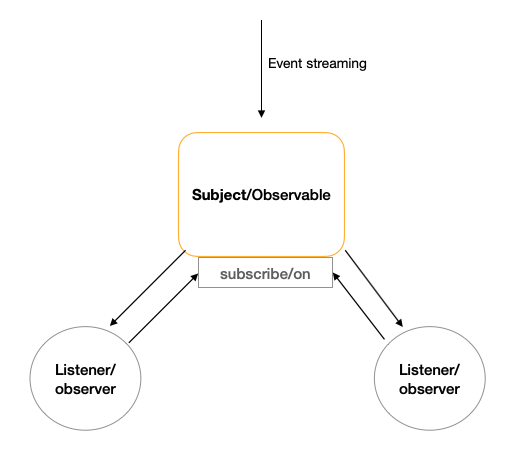

In functional programming, there are two important concepts: composition and asynchronous flow. Observer pattern, I figured, is the best pattern to describe the asynchronous flow in functional programming. When I learned the pattern, it was a bit difficult to grasp the concept because different materials use different terminologies. Thus in this post, I aim to unify and give you the essence of the pattern, then compare its usages in a number of javascript implementations. 

### What is observer pattern about ?

The pattern, by its name, is a style of programming in which an application subscribe to a certain event of a subject. When the event happens, the subject will notify all subscribers. Each subscriber can then process the data from the subject based on its needs. 



There are two main components in the picture: `Subject` and `Listener`, or `Observable` and `observer` as called in [RxJS](http://reactivex.io/). The observable can be seen as a wrapper for some asynchronous operations that may have a stream of data. What observable does is encapsulate that data let all observers knows when the data is ready. Observable has an interface i.e. `subscribe` or `on` to let observers register their handlers. 

### Event Emitter
Let us see an example using `EventEmitter` from Nodejs and implement observer pattern for a file reading action.
```js
    const events = require('events');
    const fs = require('fs');
    ...
    function readFileEvent(fileName) {
        // create new emitter instance
        const emitter = new events.EventEmitter();
        // asynchronous action
        fs.readFile(fileName, 'utf8', (error, data) => {
            if(error) {
                emitter.emit('error', error);
            }
            emitter.emit('data', data);
        });
        return emitter;
    }
```
The key thing to notice here is how `readFileEvent` create a wrapper i.e. event emitter around the asynchronous `fs.readFile` method. The wrapper in this case is the `Subject` or `Observerable`. Any client that use `readFileEvent` can later subscribe to `error` or `data` events from the wrapper.
```js
    const dataReader = readFileEvent('.\\bookings.json');
    const bookingSummaryListener = dataReader.on('data', renderData);
    const logListener = dataReader.on('error', logError); 
```

As we can see here, a subject can be subscribed from many different listeners. In the example two listeners subscribe to different events on the subject. This is the true power of observer pattern, it wraps an asynchronous action and notify all listeners when certain events happen. 

### Promise

Most of the usecases in asynchronous flow require only `success` and `failure` events. The `Promise` object in javascript is built to fullfill that usecase. For the same example, we can update the implementation using `Promise`
```js
function readFileEvent(fileName) {
        return new Promise((resolve, reject) => {
                fs.readFile(fileName, 'utf8', (error, data) => {
                if(error) {
                    reject(error);
                }
                resolve(data);
            });
        })
    }
// ...
readFileEvent('.\\bookings.json')
            .then(renderData)
            .catch(logError);
```

Usecase of `Promise` is very similar to `EventEmitter`, however there is often only one client that subscribe to a promise, as opposed to many clients for event emitter.

### RxJS

Both examples above showing clearly the application of observer pattern in asynchronous flow. What happen when the asynchronous flow contains a streaming of data or events ? That is why people create `RxJS` to handle these cases. A very simple example with [RxJS](https://rxjs-dev.firebaseapp.com/guide/overview):

```js
    import { fromEvent } from 'rxjs';
    import { throttleTime, map, scan } from 'rxjs/operators';

    fromEvent(document, 'click')
    .pipe( // wrapper of the asynchronous flows
        throttleTime(1000),
        map(event => event.clientX),
        scan((count, clientX) => count + clientX, 0)
    )
    .subscribe(count => console.log(count)); // handle subscription
```
In the example, an observable is created from document click event. The power of `RxJS` come from its operators with which we can compose many type of transformation for the event e.g throttle, map, scan. The end result of these operators is another observable. The `subscribe` function is very similar to `Promise` where client can provide `onNext`, `onComplete` or `onError` for the observable. 

### Final thoughts

It depends on each usecase to decide where you should use `EventEmitter`, `Promise` or `RxJS` or a combination of them. Essentially, they are different forms of observer pattern and very suitable to use in asynchronous flow. 

Happy learning :) 

