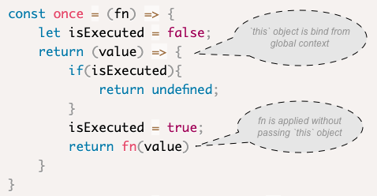

To work with Javascript(JS) effectively, you need to get used to the way functions are composed in the language. When I started learning JS, my background in C# made it a bit difficult to understand the way functions are passed around in JS applications. I hope this guide can ease the way for you. 

In this article, I will walk you throught some basic examples of composing functions, then describe the common use cases of those functions. At the end, to get you familiar with objects and functions in JS, we will try to implement a basic version of `Promises`.  

### Definition

A definition from mathematics for function composition (wikipedia)
> Function composition is an operation that takes two functions `f` and `g` and produces a function `h` such that `h(x) = g(f(x))`. In this operation the function `g` is applied to the result of applying the function `f` to `x`.

It's quite easy to understand when functions have normal values like objects or numbers as arguments e.g. `f(1)` or `g(1)`, things get more complicated when they have functions as arguments. Let's start with some simple examples before moving into composing functions.

### Array `sort`, `reduce`

Arrary methods in JS like: `reduce` or `sort` are very common for manipulating data. They accept a function as argument and then apply the function to the array. Following is an example with `sort`
```js
const orderAscending = (a,b) => a - b;
const numbers = [7,8,2,3,6];
numbers.sort(orderAscending);
console.log(numbers); //output: [2,3,6,7,8]
```
`sort` uses a comparer function to compare two values of the array, this comparer can return only `(1,-1,0)`. `Zero` is equal,`-1` means `a` is less than `b`,and conversely `1` means `a` is greater than `b`. By this api, we can change the comparer into descending by just switch the order variables being compared `orderDescending = (a,b) => b - a`.

With the same `numbers` array, assume that we want to calculate the total for it. Array `reduce` can help us do that, it accepts a reducer function and apply that function to every item in the array while also keep track of the accumulated result.
```js
const totalReducer = (total, num) => total + num;
console.log(numbers.reduce(totalReducer,0)) //output: 26
```
`Reduce` has some others interesting usages, suppose that we have a very big array, which contains some API data that we need to transform to a dictionary for faster access and update. We can revise the reducer function to achieve that as: 
```js
const data = [
    {id: 1, name: 'product 1', count: 3 },
    {id: 2, name: 'product 2', count: 2 },
    {id: 3, name: 'product 3', count: 5 },
    {id: 4, name: 'product 4', count: 6 },
    ...
];
const dictionary = data.reduce((acc, item) => {
    // loop through every item in array and add them into the dictionary
    acc[item.id] = item; 
    return acc;
}, {})
console.log(dictionary);
...
//output
{
    1: {id: 1, name: 'product 1', count: 3},
    2: {id: 2, name: 'product 2', count: 2 },
    3: {id: 3, name: 'product 3', count: 5 },
    4: {id: 4, name: 'product 4', count: 6 },
    ...
}
```
Now we have the dictionary object that can be used easier because we can retrieve an element by its index such as `dictionary[2]`. As an exercise for you, what if we want to convert `dictionary` back to an array of data again? (*hint* use `Object.keys` and `reduce`)

### Reducing functions

In my first post about `this` and closure in JS, I mentioned that we can pass functions around in JS applications. Then instead of data array, suppose that we have an array of functions and need to apply all the functions to a value 

```js
const minus = (a) => a - 2;
const add = (a) => a + 1;
const multiple = (a) => a * 10;
const operations = [minus, add, multiple];
```

Javascript follows *declarative* programming mechanism, most of the time it has a final function like `calculate(x)` to apply all the functions in `operations` to a number instead of the imperative style `minus(add(multiple(1)))` even though the twos can yield the same result. At first attempt to compose a single function, we can try to use `reduce` to apply each function to a value:
```js
const result = operations.reduceRight((acc, f) => { 
    // `reduceRight` is similar to `reduce`, but it can 
    // keep the order from right to left  
    return f(acc);
},1); 
console.log(result); //output: 9
console.log(minus(add(multiple(1)))) 
//output: 9 = (1*10) + 1 - 2
```
Notice that we don't have the final function like `calculate(x)` yet, what if we need to apply the list of functions to more values e.g. `calculate(1), calculate(3)... `? 

Second attempt, instead of apply `f()` immediately, it should return a new function

```js
const calculate = operations.reduceRight((acc, f) => {   
    return (value) => f(acc(value));
});
calculate(1); //output 9
```
Now we have a single function that composed from an array of functions. Then at final step, we can remove the intermediate `operations` and create an utility function that can be re-used for different arrays of functions.
```js
const compose = (...fns) => { //fns replaces `operations` array
    return (value) => {
        return fns.reduceRight((acc,fn) => fn(acc), value)
    }
}
// Now we can write calculate function as 
const calculate = compose(minus,add,multiple);
calculate(1): //output 9
compose(minus,add)(1) //output 0
```
What change now is that `operations` is replaced by `fns` argument as the input for our utility function. Then `compose` function returns another function which will be applied with the list of `fns` argument when it executes. 

`compose` is quite common and so useful that many libraries have their own implementation for it e.g. [Underscore](https://devdocs.io/underscore/index#compose) or [Redux](https://redux.js.org/api/compose). If you work in React Redux app, the second form of function 
```js
compose(minus,add)(1)
```
 can be familiar to you. Assume that we have a React component that has many Higher-Order Component (HOC) wrappers, we can use `compose` to have a concise structure like

```js
export default compose(
    React.memo,
    HOCWrapper1,
    HOCWrapper2,
    connect(mapStateToProps, mapDispatchToProps) //from react-redux
)(MyComponent)

// if don't use `compose`, we'd have to write
export default React.memo(
    HOCWrapper1(
        HOCWrapper2(
            connect(mapStateToProps, mapDispatchToProps)(MyComponent)
            )))
```
The first style is much cleaner to describe all the wrappers around the component. Notice the order when apply the functions can produce different results. For example

```js
// result of 
compose(minus,add,multiple)
// is different with
compose(add,multiple,minus)
```
Thus, you should pay attention to the order of applying functions in `compose` before using it.

### Closure in function composition

Closure in JS revolves around state of functions. We need closure when we want to retrieve some state in function's execution context. Assume that we need to call a `chargeCredit` function at the final step of checkout, because this function is important, we can add a wrapper to make sure it is called only once time.

```js
const once = (fn) => {
    let isExecuted = false;
    return (value) => {
        if(isExecuted){
            return undefined;
        }
        isExecuted = true;
        return fn(value)
    }
}
const chargeCredit = once((value) => {
    console.log("deduct balance: ", value)
});
chargeCredit(10); // output: deduct balance: 10
chargeCredit(5); // output: undefined
```

As we can see, when calling function at the second time `chargeCredit(5)`, it returns `undefined` which is what we expected. Essentially, what `once` does is just create a closure for the input function. Inside that closure, it can check whether the function is already executed. Things work well until we need to use `once` function on a method of an object. For example:

```js
const bankAccount = {
    balance: 50,
    chargeCredit: once(function(value) {
        this.balance -= value;
    })
};
bankAccount.chargeCredit(10); 
console.log(bankAccount.balance) //output: 50 ??
```
Let's pause for some moments and try to figure out what went wrong `...`

Apparently, current implementation of `once` does not work for objects. What just happened is that we use the utility `once` on a method of an object, this method need to access to `this` context when it executes, but in current implementation what we have is 



Let's fix those two problems by passing `this` context.

```js
const once = (fn) => {
    let isExecuted = false;
    return function (value) {
        if(isExecuted){
            return undefined;
        }
        isExecuted = true;
        fn.call(this, value);
    }
}

// apply it to bankAccount again
const bankAccount = {
    balance: 50,
    chargeCredit: once(function(value) {
        this.balance -= value;
    })
};
bankAccount.chargeCredit(10);
console.log(bankAccount.balance); //output: 40
bankAccount.chargeCredit(10);
console.log(bankAccount.balance); //output: 40
```
It works properly now, the first call to `chargeCredit`, the balance is deducted by 10, when the second call to `chargeCredit`, the balance remains unchanged. 

At this point, some of you might have question about `compose` and `once`, *why `once` function takes into account for `this` context when apply the function while `compose` does not*? 

If we look at function arguments of `compose`, we can see they are context agnostic. For example, assume that we have

```js
const calculate = compose(objA.minus, objB.add, objC.multiple)
```
then the new `calculate` function needs to be executed on another object, which doesn't have to be either `objA`, `objB` or `objC`. In contrast, `once` function accepts a function, thus it acts as a function decorator of the function argument. That function argument can be a method on an object or a pure function (functions that do not need to access `this` object). To make `once` function works for all cases, it must pass `this` context when executing.

### Closure with objects

As we see in the implementation of `once`, it just has a simple flag: `isExecuted` inside a closure. Suppose that we use an object instead of a boolean flag, we can store much more data. A common use case is caching results of function calculation, in JS this technique is called *memoization*. 

```js
const memoize = (fn) => {
    const result = {};
    return function(...args) {
        const key = JSON.stringify(args);
        if(!result[key]) {
            result[key] = fn.apply(this,args)
        }
        return result[key];
    }
}
```

Similar to `once`, the `memoize` function needs to handle input function and return another function with a wrapped closure. In the closure, it has an object to cache the results for the original function. Following example for using `memoize` with a function.

```js
const longOperation = (value) => {
    let i = 1000;
    while(i > 0) {
        i -= 1;
    }
    console.log('operation executed');
    return value;
}
const fastOperation = memoize(longOperation);
fastOperation(5); //output: operation executed 5
fastOperation(5); //output: 5
fastOperation(7); //output: operation executed 7
```
The example shows that `fastOperation`, which is composed from `memoize(longOperation)` can cache its result for each input value when executing. The first time a value is applied e.g. `fastOperation(5)`, the function runs normally and cache the result, second time when call `fastOperation(5)` again, the function just returns the cached result immediately. 

This `memoization` is quite helpful for improving performance in some cases, but we need to use it with a good consideration. For example in the serializing `key` of this implementation, it uses `JSON.stringify`, but if the array is big `JSON.stringify` can slow down the computation, and the memory need to spend to cache results also increases. 

Memoization technique is popular in recursive calculations e.g. fibonacci number. It can also be found in [React.memo](https://reactjs.org/docs/react-api.html#reactmemo) or [`Reselect`](https://github.com/reduxjs/reselect) library, which is quite common in React Redux app. 

### Javascript Promise

`Promise` is a built-in object in JS, much like other objects or arrays. Promise encapsulates asynchronous operation in JS app, and provide a better way to deal with asynchronous actions instead of callbacks. With function composition and closure, let's try to do reverse engineering for `Promise`. At the first draft, we know when using `Promise` it needs to be a new object, and it has to handle a wrapped asynchronous function.

```js
class MyPromise { // version 1
    constructor(fn) {
        this.state = 'Pending'; // possible value: 'Resolved', `Rejected'
    }
}
```
With this basic class, let's compare it with simple usage of `Promise`.
```js
const myAsync = new MyPromise((resolve, reject) => {
    setTimeout(()=> {
        resolve(10);
    },4000);
})
myAsync.then(value => console.log(value));
```
The current `MyPromise` class does not have API `then` and the way to store the resolved value, let's revise the class

```js
class MyPromise { //version 2
    constructor(fn) {
        this.state = 'Pending'; // possible value: 'Resolved', `Rejected'
        this.value = null;
        this.handlers = [];
        
    }
    then(func) {
        this.handlers.push(func);
    }
}
```
The class has `then` API now, but how can an object instance of `MyPromise` get resolved or rejected ?

If you look more carefully, when the constructor function of Promise accepts a function, that function argument contains the asynchronous action. After the asynchronous action finishes, it triggers `resolve()` to update the state of the promise. Thus the function argument `fn` in our case have to be called inside the constructor with `resolve` and `reject` as 2 functional inputs. 

```js
class MyPromise { //version 3
    constructor(fn) {
        this.state = 'Pending'; // possible value: 'Resolved', `Rejected'
        this.value = null;
        this.handlers = [];
        this.resolve = this.resolve.bind(this);
        this.reject = this.reject.bind(this);
        //fn is called with `resolve` and `reject` functions
        fn(this.resolve, this.reject); 
    }
    then(func) {
        this.handlers.push(func);
    }
    resolve(value) {
        this.value = value;
        this.state = 'Resolved';
        this.handlers.forEach(f => f.call(null, value));
    }
    reject() {
        this.state = 'Rejected';
        //...
    }
    // need to implement reject, catch...
}
```
As show in the code, now `MyPromise` class can store `value` whenever a promise is resolved. What the `then` API does is just accept a function, and push it into the list of `handlers` inside promise. Later, when we call `resolve()`, these handlers can be triggered with the `value` from promise. `resolve` and `reject` are passed to `fn` as callbacks, that's why we need the bindings as following
```js
this.resolve = this.resolve.bind(this);
this.reject = this.reject.bind(this);
fn(this.resolve, this.reject);
```
 Let's run the example again
```js
const myAsync = new MyPromise((resolve, reject) => {
    setTimeout(()=> {
        console.log('Resolved');
        resolve(10);
    },4000);
})
myAsync.then(value => console.log(value)); //output: Resolved 10
```
*Note*: `MyPromise` is implemented based on my understanding of Promise in JS, for a complete implementation please refer to [Implementing JS](promisejs.org/implementing/), there are certain differences, but the idea remains the same.

### Summary

In this article, we went from some simple compositions of functions in `sort`, `reduce`, to implementing some utilities like `once` or `compose`. We also describe how to use *closure* in different cases, especially for `memoize` function. Finally with the reverse engineering of `promises`, hopefully it can give you a clearer picture of how objects and functions in JS are used and constructed.

### References

[Array sort](https://developer.mozilla.org/en-US/docs/Web/JavaScript/Reference/Global_Objects/Array/sort) [Reduce](https://developer.mozilla.org/en-US/docs/Web/JavaScript/Reference/Global_Objects/Array/reduce)

[Declarative vs imperative programming](https://codeburst.io/declarative-vs-imperative-programming-a8a7c93d9ad2)

[Underscore compose](https://devdocs.io/underscore/index#compose) [Redux compose](https://redux.js.org/api/compose)

[React Redux's connect](https://react-redux.js.org/api/connect)

[JSON.stringify](https://developer.mozilla.org/en-US/docs/Web/JavaScript/Reference/Global_Objects/JSON/stringify)

