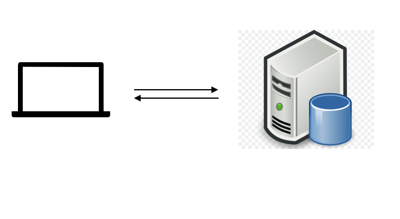
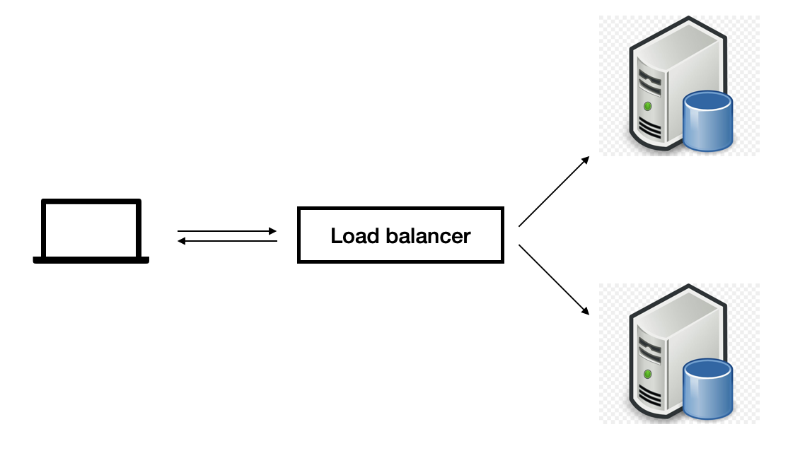

>There are only two hard things in Computer Science: cache invalidation and naming things.
>
>-- Phil Karlton

### 1. Introduction

State management is one of the most difficult problems in web development. It refers to the process of storing and retrieving user data that occurs when they interact with applications. e.g. users login, checkout form data, shopping cart items...etc. The process greatly affects the scalability and performance of web apps. If not done well, it will also impact maintainability of the applications. In this article, I will try to analyse some problems and possible solutions when dealing with states in web applications.

### 2. Why we need state on clientside

Traditionally, web applications mostly constructs html pages on server side like (aspx or jsp), user data is prepared and built directly into webpages on the server. What users get on clientside is a complete presentation of their data. After interacting with the page like filling a form or checkout a shopping cart, all the necessary data is transfered and stored on serverside. 

 
*
Figure 1: Single server
*

With the development of AJAX technology and modern clientsides frameworks like React, Angular, Vue, users data is primarily kept on clientside to improve the users experience as they will get faster responses from the applications, as opposed to long waiting time when every user interaction requires a full page reload as in tradditional websites.

Another important reason to have clientside state is the scalability of web servers. Imagine there's a webserver that store session data of users in its application state. Problem arises when we want to put multiple servers for different locations or regions to serve the website faster.

 
*
Figure 2: Servers with load banlancer
*

There will be time that one server is down and the load balancer need to redirect the server's traffic to different server. Consequently, we need to find a way to maintain the session state of the old server. Maintenaince server state is hard and it proves to be very complex, depending on what kind of state the they need to manage. A more simple and common solution is to keep server stateless, which means whenever users send requests to servers, the request should have all the neccessary state information for server to process. Thus, reducing the need to store data on server. This principle is valid for any kind of web services and api application. 

In complex web apps, each page can be a sepearate web application, to share state between each page is also an interesting problem. The state can be kept in local storage so that when user navigate to a different page (i.e different web app), the page can get all the existing state assumes that these web apps are on the same domain. If the web apps are deployed with different domains, these pages need to transfer state from client to server.
 
### 3. How to transfer state from client to server

The most prevalent way to send data from clientside to servers is through Url params. Although, there's a limit on maximun url length, it's suitable for normal usecases in web applications. The benefit of sharing url is the web apps are more independent from local state which makes them easier to testing end to end.

With more sensitive data of users like sessionId, access token, request cookie is a suitable place to carry the data. To enhance the security of data in cookies, to prevent attacks like XSS (cross site scripting) injection, there are many flag that can be set in cookies from server or clientside. The rest of data can be put in body of ajax request.

### 4. How to manage state

There are two main state on clientside: api data, user interaction (UI) state i.e form data, filtered options...etc. It is important to categorize each kind of state in web appliation as it will make clear which one should be stored and managed by web app, the rest can be used and disposed in seperate UI component. 

Whether you use a state management library (e.g Redux, Flux or Mobx ...etc) or handle the state manually, there's a simple principle to stick to which is clientside state can be considered as a kind of database of web app. As we all knows in database, it needs to store and retrieve data efficiently, thus it is required to mitigate the problem of data duplication. Indexing is also a popular technique to improve performance when reading the data. 

The common problem of using a state management library is that it is easy to store everything in the global state, including the data that application doesn't need to share. This usually happends for api data. When saving all raw api data, it can be less optimized when reading them. The proper way to handle data of ajax call is to transform and normalize before storing. For example, in product list on search results page, web api returns a list of products, when normalize the data, we can create a dictionary with productId as key and the rest of data is in an object associate with that key. 

In data intensive web apps, it is not feasible to handle all state in a single, global store. A more feasible approach is divide and conquer. A web page is a collection of components, thus we can divide the data management duty to smaller components when suitable. Libraries like React provides many way for a component to manage its state (component state, hooks or context api). For web app that get data from GraphQl server, there are many graphQL client libaries (e.g. relay, Apolo client) that enable data to live inside smaller components. They also have a quite complex algorithm to normalize data for caching repsonse. 

### 5. Summary

This post is just a touch on the surface of state management on clientside. I hope it can provide an overview on the problems of state management. Each approach to deal with state has its own trade off but the rule of thumb should be reducing the amount of data for global state. Keeping state in smaller components and mormalized api data before storing and retrieving will always benefit application. 

Happy learning :)
