<!-- 
stateDiagram-v2
        DefineFunction: f(){}
        note right of DefineFunction
            An `env1` object is created.
        end note
        DefineFunction -> ExecuteFunction
        ExecuteFunction: f()
        note left of ExecuteFunction : `this` object is binded from `env2`.
-->

**TL;DR** Every function in Javascript has an environment (env) object associates with it, `this` object in that environment is passed from the immediate environment if not using any of `call`, `apply` or `bind` functions

###Introduction

At some point when learning the language, I think most people will be confused about the `this` object in Javascript, let's see the following codes
```js
a.sum();
const temp = a.sum;
temp();
```
The outputs of `a.sum()` and `temp()` can be unsurprisingly different, depend on the context of `this`. A more common case we can encounter if working in React applications is

```js
class MyForm extends React.Component {
    constructor(){
        // something's missing
        this.state = {
            isSubmited: false,
        }
    }
    handleSubmit() {
        this.setState({isSubmited: true});
    }
    render() {
        return <div>
            <input />
            <button type="submit" onSubmit={this.handleSubmit}/>
        </div>
    }
}
```
For the above code to work properly, we need to either write the constructor function as
```js
    constructor() {
        this.handleSubmit = this.handleSubmit.bind(this)
    }
```
or using ES6 fat arrow function for `handleSubmit` 
```js
    handleSubmit = () => {
        this.setState({isSubmited: true});
    }
```
To understand why it needs to bind `this` object, let's examine what happens when Javascript engine execute functions or expressions.

### Javascript execution context

In Javascript, functions are objects (ES6 classes are also functions, it's just the syntactic sugar for constructor function). After parse and 
evaluate expressions in function, Javascript binds all the values of arguments and creates an environment object that consists of `this` , `arguments` for that function.

```js
var a = 1;
function sum(b) { 
    return this.a + b; // env is created with b as variable
    };
sum(2); // `this` object is bind from global env
//output: 3
```

when `sum()` get executed, `this` is passed from immediate environment which is from global scope. Another example

```js
var a = 1;
var myObj = {
    a: 2,
    getValue: function() {
        return this.a;
    },
};
myObj.getValue();
// output: 2
```
Function `getValue` is executed on `myObj`, thus `this` object is `myObj`. However if we take *only* the function and execute in in the global environment.

```js
var a = 1;
var myObj = {
    a: 2,
    getValue: function() {
        return this.a;
    },
};
const getVal = myObj.getValue;
getVal();
// output: 1
```
This time, global's `this` is applied to the function and the output to console is `1`. 

### Fat arrow function

With the same example, what happens if we change the function inside `myObj` to use ES6 fat arrow function ? 

```js
var a = 1;
var myObj = {
    a: 2,
    getValue: () => {
        return this.a;
    },
};
const getVal = myObj.getValue;
getVal(); // output: 1
myObj.getValue() //output: 1
```
For fat arrow functions, `this` object is always passed from immediate environment where the function is created, *NOT* where it's executed. This subtle distinction is the main reason for most of the confusion about `this` object.  As we can see in the example where we use the arrow function for `getValue`, `this` from global context is bind to it, thus output for it is `1` in both cases.

### `call`, `apply` and `bind`

Javascript allow us to bind `this` context to a function by using `call`, `apply` or `bind`. Let's go back to the example that we have so far

```js
var a = 1;
var myObjA = {
    a: 2,
    getValue: function() {
        return this.a;
    },
};
var myObjB = {
    a: 3,
}
myObjA.getValue.apply(myObjB); //output 3
myObjA.getValue.call(myObjB); //output 3
var myObjC = {
    a: 4,
}
const getVal = myObjA.getValue.bind(myObjC);
getVal === myObjA.getValue;// false
getVal(); // output: 4
```
As we can see, `bind` and `apply` allow us to attach a `this` context into a function. In `bind` and `apply`, they can accept more arguments after `this` object, these arguments will then be passed into the function. 
An interesting usage is when we use `bind` to attach `myObjC` as `this` for `getValue`. The result shows that
a new function is created when we use `bind` on the original function, and the function also has `myObjC` included to it.

### Javascript classes

Javascript actually has no classes, if we use ES6 class syntax, it'd be compiled to constructor function

```js
class Person {
    constructor(name) {
        this.name = name;
    }
    getName(){
        return this.name;
    }
}
...
// will be compiled as 
...
function Person(name) {
    this.name = name;
}
Person.prototype.getName = function () {
    return this.name;
}
...
const personA = new Person('John');
const personB = new Person('Peter');
personA.getName(); // John
personB.getName(); // Peter
```
When constructor functions called with `new`, a new object is created. That's why in classes or constructor functions, `this` always bind to different objects.

Let's review the example with React component at the beginning
```js
class MyForm extends React.Component {
    constructor(){
        this.handleSubmit = this.handleSubmit.bind(this);
        this.state = {
            isSubmited: false,
        }
    }
    handleSubmit() {
        this.setState({isSubmited: true});
    }
    render() {
        return <div>
            <input />
            <button type="submit" onSubmit={this.handleSubmit}/>
        </div>
    }
}
```
When React render its components' tree, it will call the constructor function of `MyForm` component to create instance of the component and link it with an actual HTML DOM in document. The reason `MyForm` component need to bind `this` object is because `handleSubmit` function will be passed to the corresponding DOM in HTML page via `onSubmit={this.handleSubmit}`, in which the function will get called on a different object, compare to the component instance, so if it doesn't bind `this` object in `handleSubmit`, the function cannot access to state of `MyForm` component's instance. 

### Closure

Closure is a common characteristics of functional languages. This concept is built on top of *environment* object in functions.

```js
function f1() {
    let a = 1; // env1: {a}
    return function f2() {
        let b = a + 1; //env2: {b}
        return function f3() {
            return a + b; //env3: {}
        }
    }
}
...
f1()()(); // output: 3 
```
Each function has environment object attached to it. In the function scope when execute, if it cannot find the value for its variable in its environment, it will look for it in upper level environment.

```js
const f = f1()();
...
// f can be passed to other context
// later can be called as a callback
...
f(); //output: 3
```
Because environment object bind values for its scope where the `f1` function created, so if later it runs `f()`, the function can still be able to find the values of `a` and `b`. Binding of `this` object and *Closure* are two fundamental concepts in Javascript.

### Conclusion

Most of the time, we just need to remember a simple rule: *`this` object is passed from the immediate environment where functions get executed, except when use `call`, `apply` or `bind`*. Functions can access to all variables where they are created thanks to *closure*.

*Thanks [Bruno](https://www.linkedin.com/in/pongpolb) for doing technical review on the article*

### References
1: [Object Prototype](https://developer.mozilla.org/en-US/docs/Learn/JavaScript/Objects/Object_prototypes)

2: [Function apply](https://developer.mozilla.org/en-US/docs/Web/JavaScript/Reference/Global_Objects/Function/apply)

3: [Function call](https://developer.mozilla.org/en-US/docs/Web/JavaScript/Reference/Global_Objects/Function/call)

4: [Function bind](https://developer.mozilla.org/en-US/docs/Web/JavaScript/Reference/Global_Objects/Function/bind)

5: [React rendering elements](https://reactjs.org/docs/rendering-elements.html)