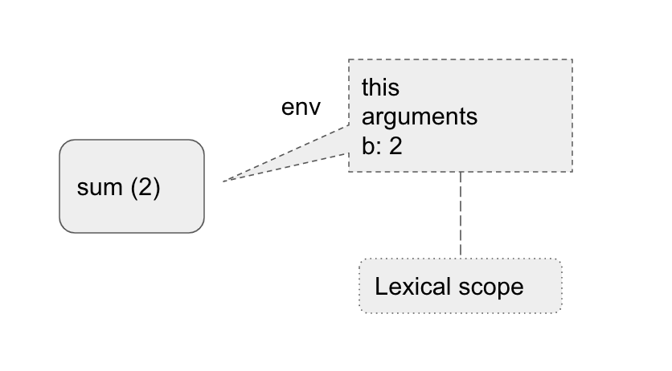

**TL;DR** Every function in javascipt has an environment object associate with it, `this` object in that environment is passed from the immediate environment if not binded from `call`, `apply` or `bind`

###Introduction

At some point when learning the language, I think most people will be confused about the `this` object in javascript, let's see the following codes
```javascript
a.sum();
const temp = sum;
temp();
```
The outputs of `a.f()` and `temp()` can be unsuprisingly different, depend on the context of `this`. A more common case we can encouter if working in React applications is

```javascript
class MyForm extends React.Component {
    constructor(){
        // something's missing
        this.state = {
            isSubmited: false,
        }
    }
    handleSubmit() {
        this.setState({isSubmited: true});
    }
    render() {
        return <div>
            <input />
            <button type="submit" onSubmit={this.handleSubmit}/>
        </div>
    }
}
```
For the above code to work properly, we need to either have to write the constructor function 
```js
    constructor() {
        this.handleSubmit = this.handleSubmit.bind(this)
    }
```
or using ES6 fat arrow function for `handlSubmit` 
```js
    handleSubmit = () => {
        this.setState({isSubmited: true});
    }
```
To understand why it needs to bind `this` object, let's examine what happens when javascript engine execute functions or expressions.

###Javascript execution context

In javascript, functions are objects (ES6 classes are also functions, it's just the syntactic sugar for constructor function). After parse and 
evaluate expressions in function, javascript binds all the values of arguments and creates an environment object that consists of `this` , `arguments`
for that function.

```js
var a = 1;
function sum(b) { 
    return this.a + b;
    };
sum(2);
//output: 3
```
With this simple function, we can visualize the environment being created like



when `sum(2)` executed `this` is passed from immediate environment which is from global scope. Another example

```js
var a = 1;
var myObj = {
    a: 2,
    getValue: function() {
        return this.a;
    },
};
myObj.getValue();
// output: 2
```
Function `getValue` is executed on `myObj`, thus `this` object is `myObj`. However if we take only the function and execute in in the global environment.

```js
var a = 1;
var myObj = {
    a: 2,
    getValue: function() {
        return this.a;
    },
};
const getVal = myObj.getValue;
getVal();
// output: 1
```
This time, global's `this` is applied to the function and the output to console is `1`

### Fat arrow function

With the same example, what happens if we change the function inside `myObj` to use ES6 fat arrow function ? 

```js
var a = 1;
var myObj = {
    a: 2,
    getValue: () => {
        return this.a;
    },
};
const getVal = myObj.getValue;
getVal(); // output: 1
myObj.getValue() //output: 1
```
For fat arrow functions, `this` object is always passed from immediate environment where the function is created, *NOT* where it's executed. As we can see in the example where we use the arrow function for `getValue`, `this` from global context is binded to it, thus output for it is `1` in both cases.

###`call`, `apply` and `bind`

Javascript allow us to bind `this` context to a function by using `call`, `apply` or `bind`. Let's go back to the example that we have so far

```js
var a = 1;
var myObjA = {
    a: 2,
    getValue: function() {
        return this.a;
    },
};
var myObjB = {
    a: 3,
}
myObjA.getValue.apply(myObjB); //output 3
myObjA.getValue.call(myObjB); //output 3
var myObjC = {
    a: 4,
}
const getVal = myObjA.getValue.bind(myObjC);
getVal === myObjA.getValue;// false
getVal(); // output: 4
```
As we can see, `bind` and `apply` allow us to attach a `this` context into a function. In `bind` and `apply`, they can accept more arguments after `this` object, these arguments will then be passed into the function. 
An interesting usage is when we use `bind` to attach `myObjC` as `this` for `getValue`. The result shows that
a new function is created when we use `bind` on the original function, and the function also has `myObjC` binded to it.

Let's review the example with React component at the begining, the reason `MyForm` component need to bind `this` object is because `handleSubmit` function will be passed to the rendered DOM in React, which then will be executed on a different object, comppare to the component instance, so if it doesn't bind `this` object in `handleSubmit`, the function cannot access to state of `MyForm` component's instance. 

### Conclusion

Most of the time, we just need to remember a simple rules: *`this` object is passed from the immediate environment where functions get executed, except when use `call`, `apply` or `bind`*
