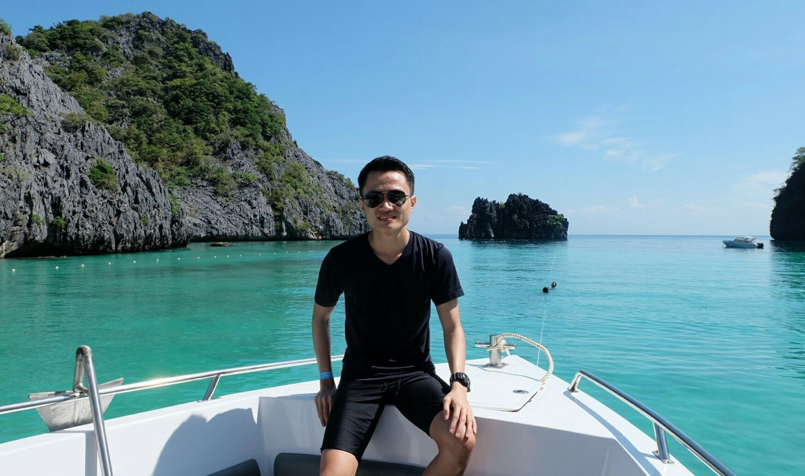

**What is this blog for?**

I build this site mainly to consolidate my knowlege in software development and hopefully it can help people sometimes when they 
need to look for related insights. I am open for ideas and suggestions, please reach out me on <a target='blank' href='https://twitter.com/thangledev'>Twitter</a> or <a target="blank" href='https://www.linkedin.com/in/thangledev'>LinkedIn</a>

<!-- **Why ads ?** 

I include ads to increase incentive for myself and help me be more productive, having more income is always nice. I apologize if it annoys you. -->

**About me**

I am ThangLe, a software engineer, although I'd like to consider myself as a practitioner of software craftsmanship. Since graduation, I've been
working primarily with web development, my current company is Agoda, an online travel agency, where I work as a fullstack developer.

My main interest is solving complex problems with simple and elegant solutions. I've become a big fan of application architecture, design patterns and functional programming.

Here are some of my favourite quotes:
>There are only two hard things in Computer Science: cache invalidation and naming things.
>
>-- Phil Karlton

>Experience keeps a dear school, but fools will learn in no other, and scarce in that
>
>If we all think alike, no one is thinking
>
>--Benjamin Franklin

